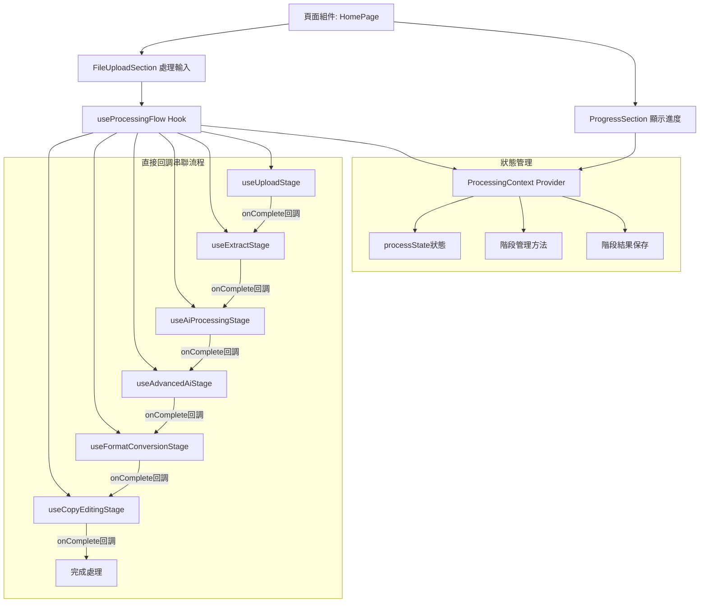
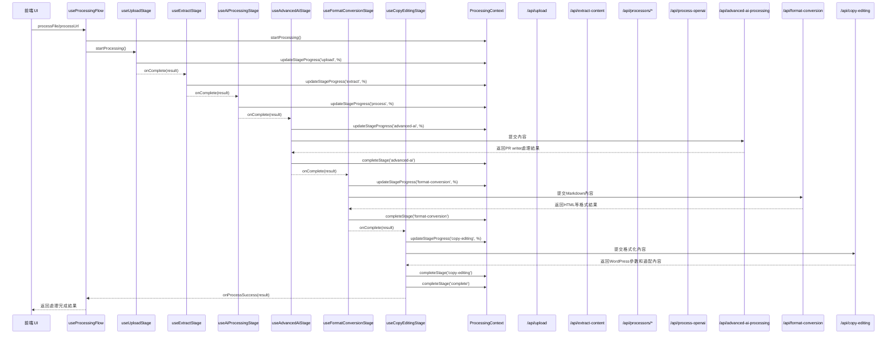
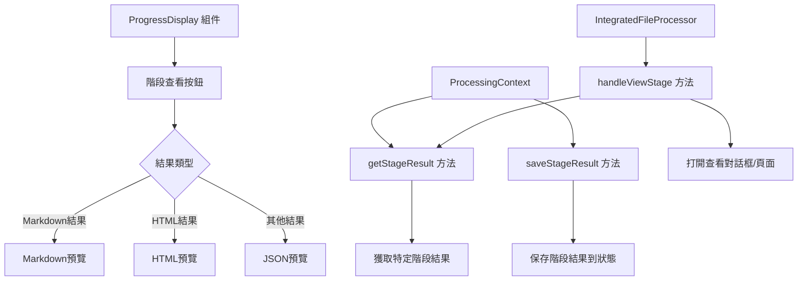

# 文件處理與進度顯示系統分析

## 1. 系統概述

系統設計採用React Context進行狀態管理，通過統一處理流程管理器處理文件和URL，並實時顯示處理進度。核心組件包括:

- **狀態管理**: `ProcessingContext` 管理所有處理階段的狀態
- **流程管理**: `useProcessingFlow` Hook作為協調器統一管理處理流程
- **專門階段處理**: 三個專用Hook處理不同階段邏輯
  - `useUploadStage` - 處理上傳階段邏輯
  - `useExtractStage` - 處理內容提取階段邏輯
  - `useAiProcessingStage` - 處理AI增強階段邏輯
- **進度顯示**: `ProgressDisplay` 組件負責可視化處理進度
- **處理流程協調**: 階段性流水線混合模式處理不同類型的輸入

## 2. 處理流程階段

系統處理流程分為七個主要階段:

1. **上傳階段(upload)**: 處理文件上傳或URL解析
2. **提取階段(extract)**: 從文件或網頁中提取文本和圖片
3. **AI初步處理階段(process)**: 使用OpenAI進行內容初步處理
4. **PR writer處理階段(advanced-ai)**: 進一步優化內容重點和結構
5. **格式轉換階段(format-conversion)**: 將Markdown轉換為其他格式(如HTML)
6. **文稿編輯階段(copy-editing)**: 提取WordPress參數並適配內容格式
7. **完成階段(complete)**: 標記整個處理過程完成

每個階段都有四種可能的狀態: `pending` (等待處理)、`processing` (處理中)、`completed` (已完成)、`error` (錯誤)。

## 3. 流程圖解

### 系統架構和狀態流



### 處理流程更新



## 4. API架構分析

### 文件處理API層級

1. **上傳層**: `/api/upload` - 處理文件上傳並返回文件URL
2. **協調層**: `/api/extract-content` - 根據文件類型選擇適當的處理器
3. **處理器層**:
   - `/api/processors/process-pdf` - PDF文件處理
   - `/api/processors/process-docx` - DOCX文件處理
   - `/api/processors/process-gdocs` - Google Docs文件處理
4. **AI處理層**: `/api/process-openai` - 使用OpenAI進行AI Agent Editing

### URL處理API層級

1. **解析層**: `/api/parse-url` - 解析URL並初始化處理
2. **處理層**: `/api/process-url` - 爬取和處理URL內容
3. **AI處理層**: `/api/process-openai` - 與文件處理共用同一API

## 5. 前端組件分析

### ProcessingContext提供的狀態和方法

- **狀態**:
  - `processState`: 包含完整的處理狀態信息
  - `stages`: 處理階段數組
  - `currentStage`: 當前處理階段
  - `overall`: 總體進度和狀態

- **方法**:
  - `startFileProcessing`: 初始化文件處理
  - `startUrlProcessing`: 初始化URL處理
  - `updateStageProgress`: 更新特定階段進度
  - `completeStage`: 完成特定階段
  - `setStageError`: 設置階段錯誤
  - `moveToNextStage`: 移動到下一階段

### 統一處理流程管理器

`useProcessingFlow` Hook作為協調器管理處理流程，提供以下功能:

- **主要方法**:
  - `processFile`: 統一處理文件上傳流程
  - `processUrl`: 統一處理URL處理流程
  - `cleanup`: 清理資源和定時器

- **專門階段處理Hooks**:
  - `useUploadStage`: 處理上傳階段邏輯
    - `uploadFile`: 處理文件上傳
    - `submitUrl`: 處理URL提交
    - `onFileUploadComplete`: 上傳完成回調
    - `onUrlParseComplete`: URL解析完成回調
  
  - `useExtractStage`: 處理內容提取階段邏輯
    - `startExtraction`: 開始內容提取
    - `extractFromFile`: 從文件提取內容
    - `extractFromUrl`: 從URL提取內容
    - `onExtractComplete`: 提取完成回調
  
  - `useAiProcessingStage`: 處理AI增強階段邏輯
    - `startAiProcessing`: 開始AI處理
    - `processWithOpenAI`: 使用OpenAI處理內容
    - `onProcessComplete`: 處理完成回調

### 進度顯示組件

1. **ProgressSection**: 頁面中的進度區塊容器
2. **ProgressDisplay**: 詳細的進度和階段顯示組件
   - 顯示總體進度條
   - 顯示各階段狀態
   - 顯示處理元數據

### 異常處理機制

系統實現了完整的錯誤處理機制:
- 階段錯誤狀態設置: `setStageError`
- 在UI中清晰顯示錯誤信息
- 提供部分錯誤恢復能力(例如跳過AI處理階段)

## 7. 處理流程對照表

| 階段 | PDF上傳流程 | DOCX上傳流程 | 一般URL | Google Docs URL | Medium文章 | WeChat公眾號 |
|------|------------|-------------|---------|----------------|------------|-------------|
| **upload** | • 上傳PDF文件<br>• 獲取fileUrl<br>• 更新上傳進度<br>• `/api/upload` | • 上傳DOCX文件<br>• 獲取fileUrl<br>• 更新上傳進度<br>• `/api/upload` | • 解析URL<br>• 存儲URL信息<br>• 生成urlId<br>• `/api/parse-url` | • 相同的URL解析<br>• 檢測為gdocs類型<br>• `/api/parse-url` | • 相同的URL解析<br>• 檢測為medium類型<br>• `/api/parse-url` | • 相同的URL解析<br>• 檢測為wechat類型<br>• `/api/parse-url` |
| **extract** | • PDF轉換為DOCX<br>• 提取文本和圖片<br>• 創建Markdown<br>• `/api/processors/process-pdf`<br>• 再轉到`/api/processors/process-docx` | • 直接提取DOCX文本和圖片<br>• 創建Markdown<br>• `/api/processors/process-docx` | • 網頁爬取<br>• 提取網頁內容<br>• 處理圖片<br>• 創建Markdown<br>• `/api/process-url` | • 使用特殊爬取方法<br>• 提取Google文檔結構<br>• `/api/process-url` | • 使用Medium專用爬取<br>• 處理Medium特定結構<br>• `/api/process-url` | • 處理微信公眾號登入牆<br>• 特殊提取微信內容<br>• `/api/process-url` |
| **process** | • AI Agent Editing<br>• 創建增強版Markdown<br>• `/api/process-openai` | • AI Agent Editing<br>• 創建增強版Markdown<br>• `/api/process-openai` | • AI Agent Editing<br>• 創建增強版Markdown<br>• `/api/process-openai` | • 與標準流程相同<br>• `/api/process-openai` | • 與標準流程相同<br>• `/api/process-openai` | • 與標準流程相同<br>• `/api/process-openai` |
| **advanced-ai** | • 進一步優化內容重點和結構<br>• `/api/advanced-ai-processing` | • 進一步優化內容重點和結構<br>• `/api/advanced-ai-processing` | • 進一步優化內容重點和結構<br>• `/api/advanced-ai-processing` | • 與標準流程相同<br>• `/api/advanced-ai-processing` | • 與標準流程相同<br>• `/api/advanced-ai-processing` | • 與標準流程相同<br>• `/api/advanced-ai-processing` |
| **format-conversion** | • 將Markdown轉換為HTML<br>• `/api/format-conversion` | • 將Markdown轉換為HTML<br>• `/api/format-conversion` | • 將Markdown轉換為HTML<br>• `/api/format-conversion` | • 與標準流程相同<br>• `/api/format-conversion` | • 與標準流程相同<br>• `/api/format-conversion` | • 與標準流程相同<br>• `/api/format-conversion` |
| **copy-editing** | • 提取WordPress參數並適配內容格式 | • 提取WordPress參數並適配內容格式 | • 解析URL並適配內容格式 | • 解析URL並適配內容格式 | • 解析URL並適配內容格式 | • 解析URL並適配內容格式 |
| **complete** | • 保存最終Markdown<br>• 更新處理完成狀態<br>• 生成查看連結 | • 保存最終Markdown<br>• 更新處理完成狀態<br>• 生成查看連結 | • 保存最終Markdown<br>• 更新處理完成狀態<br>• 生成查看連結 | • 與標準流程相同 | • 與標準流程相同 | • 與標準流程相同 |

## 9. 階段性流水線混合模式的實現

### 當前系統架構

系統採用統一的**階段性流水線混合模式**，通過直接回調串聯流程：

```
輸入(文件/URL) → [階段完成，直接回調] → 內容提取 → [階段完成，直接回調] → AI處理 → [階段完成，直接回調] → 完成
```

核心架構改進：

1. **三層模組化實現**：
   - `useProcessingFlow` - 頂層協調器，不再實現具體處理邏輯
   - 專門階段處理Hooks - 各自處理特定階段邏輯
   - `ProcessingContext` - 提供狀態管理和UI更新

2. **直接回調串聯機制**：
   - 不再使用狀態監聽觸發下一階段
   - 使用直接回調串聯階段流轉
   - 避免了因useEffect監聽狀態造成的無限循環問題

### 直接回調串聯機制

階段性流水線混合模式的核心是直接回調串聯機制，通過以下方式實現：
- 上傳階段完成回調:
   ```typescript
   onFileUploadComplete: async (fileUrl, fileType, fileId) => {
     // 更新上傳階段狀態
     completeStage('upload');
     // 直接開始提取階段
     await extractStage.startExtraction({
       inputType: 'file',
       fileUrl,
       fileType,
       fileId
     });
   }
   ```

- 提取階段完成回調:
   ```typescript
   onExtractComplete: async (result) => {
     // 更新提取階段狀態
     completeStage('extract');
     // 直接開始AI處理階段
     if (result.markdownKey) {
       await aiProcessingStage.startAiProcessing(result);
     }
   }
   ```

- AI處理階段完成回調:
   ```typescript
   onProcessComplete: (result) => {
     // 更新AI處理階段狀態
     completeStage('process');
     completeStage('complete');
     // 返回最終結果
     return result;
   }
   ```

這種直接回調串聯方式相比狀態監聽有以下優勢：
- 避免了循環渲染和狀態更新問題
- 處理流程更直接、可讀性更高
- 錯誤處理更精確
- 性能更好，減少不必要的組件重渲染

## 10. 混合模式架構的模組化實現

系統採用模組化實現，將處理邏輯拆分為多個專門的Hook：

1. **useUploadStage**: 處理上傳階段邏輯
   - 負責文件上傳或URL解析
   - 通過`onFileUploadComplete`或`onUrlParseComplete`回調觸發下一階段
   - 在錯誤時提供專門的錯誤處理和資源清理

2. **useExtractStage**: 處理內容提取階段邏輯
   - 負責從文件或URL提取內容
   - 通過`onExtractComplete`回調觸發下一階段
   - 處理不同輸入類型的提取策略

3. **useAiProcessingStage**: 處理AI處理階段邏輯
   - 負責AI增強內容
   - 通過`onProcessComplete`回調完成整個處理流程
   - 處理AI處理相關的錯誤和恢復

4. **useProcessingFlow**: 統一流程協調器
   - 協調各階段Hook的初始化和交互
   - 提供統一的處理入口API
   - 確保資源清理和錯誤處理

這種模組化設計的優勢：
- **關注點分離**：每個Hook只負責特定階段的邏輯
- **可測試性**：每個階段可以獨立測試
- **可維護性**：修改特定階段邏輯不影響其他階段
- **可重用性**：不同輸入類型可以重用相同的階段處理邏輯
- **擴展性**：易於在階段之間添加用戶干預步驟

## 11. 性能優化與架構改進

### 統一處理流程架構的優化

改進後的架構實現了以下性能優化：

1. **避免渲染循環**：
   - 移除了基於狀態監聽的階段觸發機制
   - 使用直接回調串聯替代狀態變化和useEffect監聽
   - 顯著減少了組件重渲染次數

2. **優化函數引用穩定性**：
   - 各階段Hook使用useCallback保證函數引用穩定
   - 明確的依賴項管理，避免無必要的重新創建
   - 參數化所有回調函數，減少閉包引用

3. **資源優化**：
   - 所有階段Hook提供cleanup方法，確保資源正確釋放
   - 定時器和監聽器在完成或錯誤時自動清理
   - 減少內存洩漏風險

### 實現對比

| 原始實現 | 改進實現 |
|---------|---------|
| 狀態監聽觸發階段流轉 | 直接回調串聯流程 |
| 處理邏輯集中在useProcessingFlow | 處理邏輯分散至專門階段Hook |
| 通過組件監聽處理流程 | 刪除處理組件，使用Hook直接處理 |
| 複雜的狀態依賴和更新機制 | 簡化的狀態更新和依賴關係 |

### 效能提升

1. **更快的處理速度**：通過直接回調串聯減少了狀態更新和渲染循環，使處理流程更加高效

2. **更少的內存佔用**：專門的階段Hook和更精確的資源管理減少了內存佔用

3. **更好的錯誤隔離**：每個階段Hook處理自己的錯誤，更容易定位和修復問題

4. **更好的可維護性**：
   - 關注點分離使代碼更易於理解和維護
   - 各階段邏輯獨立封裝，便於單獨測試
   - 統一的協調器使整體流程清晰可控

### API兼容性
重構實現完全保持了原有API的兼容性，所有後端API的接口和功能保持不變，確保：

1. 系統可以通過API直接調用，不依賴於前端界面
2. 原有的自動化流程和整合方案可以繼續運作
3. 未來可以輕鬆添加新的前端界面或後端服務

這種改進使系統同時獲得了良好的用戶體驗和API整合能力，既可以作為獨立應用運行，也可以作為服務被其他系統調用。

## 12. 階段結果查看功能

### 功能概述

系統新增階段結果查看功能，允許用戶查看每個處理階段的結果，包括：

1. **結果存儲**: 在 `ProcessingContext` 中存儲每個階段的處理結果
2. **查看界面**: 在進度顯示中為已完成階段添加「查看」按鈕
3. **結果預覽**: 根據階段類型顯示不同的結果預覽（Markdown、HTML等）

### 實現架構



### 結果查看流程

1. **保存階段結果**:
   - 每個階段完成時，使用 `saveStageResult(stageId, result)` 保存結果
   - 結果保存在 `processState.stageResults` 物件中

2. **顯示查看按鈕**:
   - `ProgressDisplay` 組件在已完成階段旁顯示「查看」按鈕
   - 按鈕僅在階段有結果且非上傳階段時顯示

3. **點擊查看流程**:
   - 點擊「查看」按鈕調用 `onViewStage(stageId, result)` 回調
   - 父組件 `IntegratedFileProcessor` 處理查看行為
   - 根據階段類型顯示相應的預覽或打開查看頁面

4. **查看方式**:
   - **對話框預覽**: 在頁面內顯示內容預覽（默認）
   - **新窗口查看**: 點擊按鈕跳轉到特定結果頁面（如查看完整內容）

### 各階段結果格式

| 階段ID | 結果类型 | 查看方式 | 結果數據 |
|-------|---------|---------|---------|
| extract | Markdown | 內容預覽+新窗口 | markdownContent, markdownKey |
| process | Markdown | 內容預覽+新窗口 | markdownContent, markdownKey |
| advanced-ai | Markdown | 內容預覽+新窗口 | markdownContent, markdownKey |
| format-conversion | HTML | 內容預覽+新窗口 | htmlContent, htmlKey |
| copy-editing | 格式化內容 | 內容預覽+新窗口 | formattedContent, formattedKey |
| complete | 最終結果 | 預覽+新窗口 | markdownContent, markdownKey, htmlContent, htmlKey |
