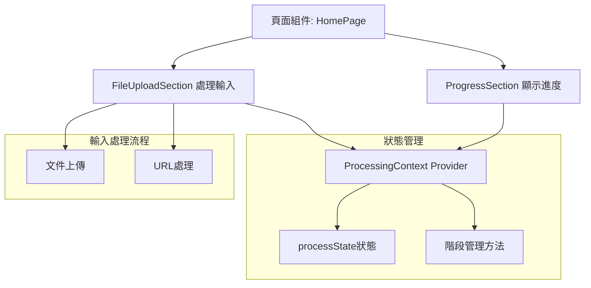
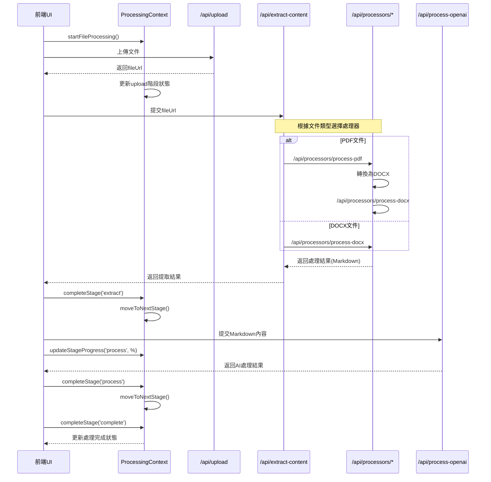
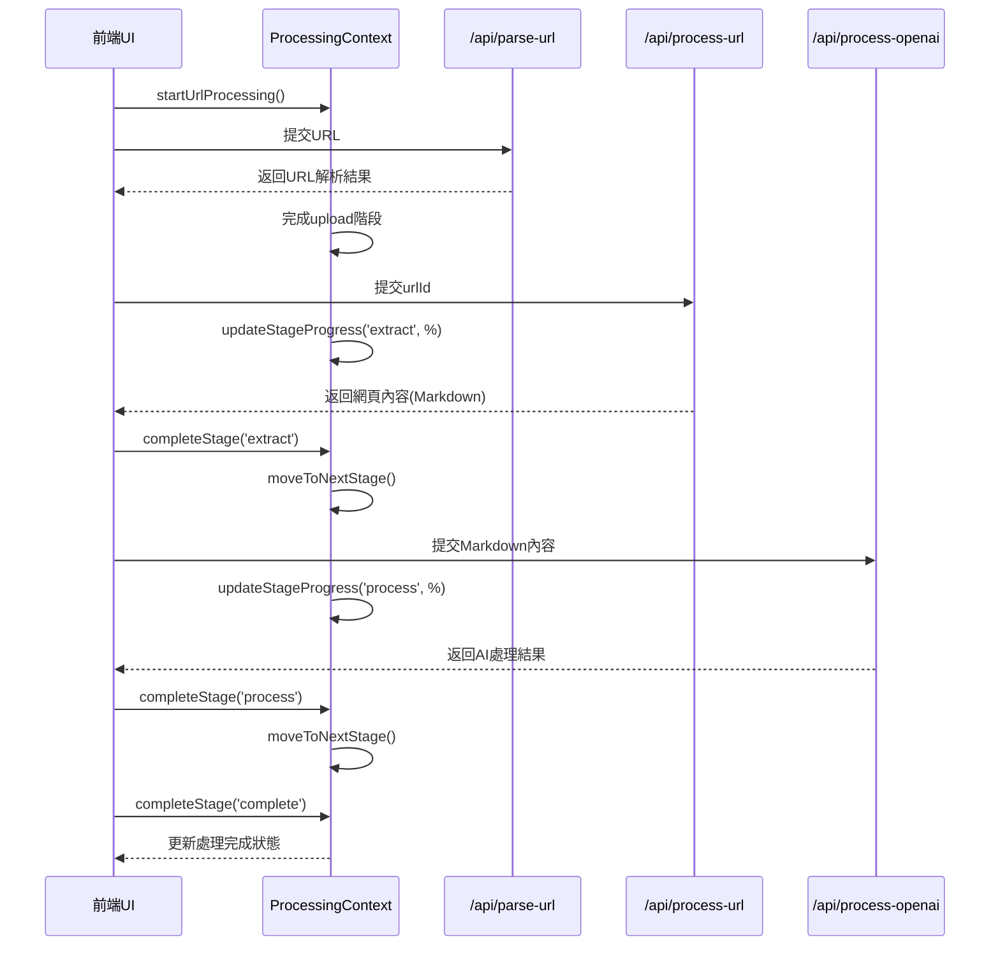
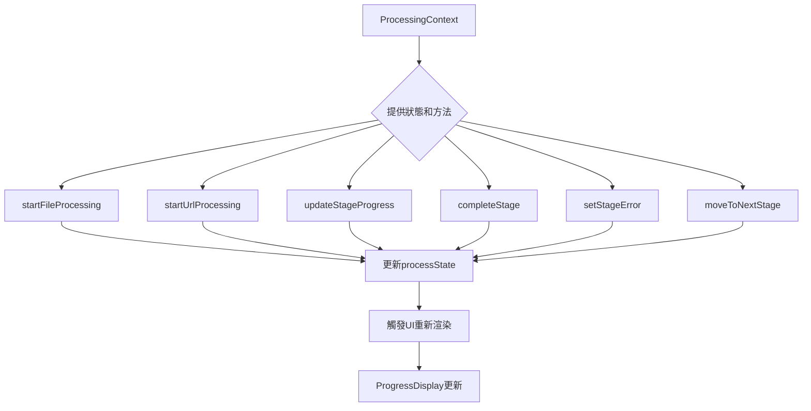

# 文件處理與進度顯示系統分析

## 1. 系統概述

系統設計採用React Context進行狀態管理，通過分層API架構處理文件和URL，並實時顯示處理進度。核心組件包括:

- **狀態管理**: `ProcessingContext` 管理所有處理階段的狀態
- **進度顯示**: `ProgressDisplay` 組件負責可視化處理進度
- **處理流程協調**: 分層API結構處理不同類型的輸入和處理階段

## 2. 處理流程階段

系統處理流程分為四個主要階段:

1. **上傳階段(upload)**: 處理文件上傳或URL解析
2. **提取階段(extract)**: 從文件或網頁中提取文本和圖片
3. **AI處理階段(process)**: 使用OpenAI進行AI Agent Editing
4. **完成階段(complete)**: 標記整個處理過程完成

每個階段都有四種可能的狀態: `pending` (等待處理)、`processing` (處理中)、`completed` (已完成)、`error` (錯誤)。

## 3. 流程圖解

### 系統架構和狀態流



### 文件處理流程



### URL處理流程



### 狀態管理內部邏輯



## 4. API架構分析

### 文件處理API層級

1. **上傳層**: `/api/upload` - 處理文件上傳並返回文件URL
2. **協調層**: `/api/extract-content` - 根據文件類型選擇適當的處理器
3. **處理器層**:
   - `/api/processors/process-pdf` - PDF文件處理
   - `/api/processors/process-docx` - DOCX文件處理
4. **AI處理層**: `/api/process-openai` - 使用OpenAI進行AI Agent Editing

### URL處理API層級

1. **解析層**: `/api/parse-url` - 解析URL並初始化處理
2. **處理層**: `/api/process-url` - 爬取和處理URL內容
3. **AI處理層**: `/api/process-openai` - 與文件處理共用同一API

## 5. 前端組件分析

### ProcessingContext提供的狀態和方法

- **狀態**:
  - `processState`: 包含完整的處理狀態信息
  - `stages`: 處理階段數組
  - `currentStage`: 當前處理階段
  - `overall`: 總體進度和狀態

- **方法**:
  - `startFileProcessing`: 初始化文件處理
  - `startUrlProcessing`: 初始化URL處理
  - `updateStageProgress`: 更新特定階段進度
  - `completeStage`: 完成特定階段
  - `setStageError`: 設置階段錯誤
  - `moveToNextStage`: 移動到下一階段

### 進度顯示組件

1. **ProgressSection**: 頁面中的進度區塊容器
2. **ProgressDisplay**: 詳細的進度和階段顯示組件
   - 顯示總體進度條
   - 顯示各階段狀態
   - 顯示處理元數據
3. **ProcessingProgress**: 更簡化的進度顯示組件(目前未使用)

## 6. 實現差異分析

### 計劃vs實際實現

計劃文檔中的階段設計與實際實現有差異:

| 計劃文檔階段 | 實際實現階段 |
|--------------|-------------|
| `uploading`, `extracting`, `AI Agent Editing`, `complete` | `upload`, `extract`, `process`, `complete` |

實際實現簡化了階段划分，將AI Agent Editing統一歸為一個`process`階段處理。

### 異常處理機制

系統實現了完整的錯誤處理機制:
- 階段錯誤狀態設置: `setStageError`
- 在UI中清晰顯示錯誤信息
- 提供部分錯誤恢復能力(例如跳過AI處理階段)

## 7. 處理流程對照表

| 階段 | PDF上傳流程 | DOCX上傳流程 | 一般URL | Google Docs URL | Medium文章 | WeChat公眾號 |
|------|------------|-------------|---------|----------------|------------|-------------|
| **upload** | • 上傳PDF文件<br>• 獲取fileUrl<br>• 更新上傳進度<br>• `/api/upload` | • 上傳DOCX文件<br>• 獲取fileUrl<br>• 更新上傳進度<br>• `/api/upload` | • 解析URL<br>• 存儲URL信息<br>• 生成urlId<br>• `/api/parse-url` | • 相同的URL解析<br>• 檢測為gdocs類型<br>• `/api/parse-url` | • 相同的URL解析<br>• 檢測為medium類型<br>• `/api/parse-url` | • 相同的URL解析<br>• 檢測為wechat類型<br>• `/api/parse-url` |
| **extract** | • PDF轉換為DOCX<br>• 提取文本和圖片<br>• 創建Markdown<br>• `/api/processors/process-pdf`<br>• 再轉到`/api/processors/process-docx` | • 直接提取DOCX文本和圖片<br>• 創建Markdown<br>• `/api/processors/process-docx` | • 網頁爬取<br>• 提取網頁內容<br>• 處理圖片<br>• 創建Markdown<br>• `/api/process-url` | • 使用特殊爬取方法<br>• 提取Google文檔結構<br>• `/api/process-url` | • 使用Medium專用爬取<br>• 處理Medium特定結構<br>• `/api/process-url` | • 處理微信公眾號登入牆<br>• 特殊提取微信內容<br>• `/api/process-url` |
| **process** | • AI Agent Editing<br>• 創建增強版Markdown<br>• `/api/process-openai` | • AI Agent Editing<br>• 創建增強版Markdown<br>• `/api/process-openai` | • AI Agent Editing<br>• 創建增強版Markdown<br>• `/api/process-openai` | • 與標準流程相同<br>• `/api/process-openai` | • 與標準流程相同<br>• `/api/process-openai` | • 與標準流程相同<br>• `/api/process-openai` |
| **complete** | • 保存最終Markdown<br>• 更新處理完成狀態<br>• 生成查看連結 | • 保存最終Markdown<br>• 更新處理完成狀態<br>• 生成查看連結 | • 保存最終Markdown<br>• 更新處理完成狀態<br>• 生成查看連結 | • 與標準流程相同 | • 與標準流程相同 | • 與標準流程相同 |

## 8. 改進建議

1. **進度更新與後端同步**:
   - 實現WebSocket或SSE進度更新機制
   - 為長時間處理任務提供更準確的進度報告

2. **錯誤恢復增強**:
   - 添加重試機制
   - 提供回退到特定階段的能力

3. **處理任務持久化**:
   - 添加任務ID和狀態持久化
   - 實現任務歷史和恢復功能

4. **進度顯示優化**:
   - 更詳細的階段進度信息
   - 更清晰的元數據顯示
   - 生成處理報告功能

5. **性能優化**:
   - 添加大文件分塊處理
   - 背景處理和通知機制

## 9. 階段性流水線混合模式的實現

### 當前系統存在的核心問題

系統實現分析後，發現存在核心架構不一致問題：

1. **文件上傳流程**：已經實現良好的階段性流水線模式
   ```
   上傳文件 → [前端控制] → 提取內容 → [前端控制] → AI處理 → [前端控制] → 完成
   ```

2. **URL處理流程**：特別是Google Docs流程存在處理邏輯問題
   ```
   提交URL → [前端控制] → 處理URL(內容提取+AI處理的後端自動流水線) → [輪詢] → 完成
   ```

最大的問題在於：**URL處理中將內容提取(extract)和AI處理(process)兩個獨立階段錯誤地合併成一個流水線**，導致：
- 階段切換不清晰，前端無法準確知道當前處理階段
- 被迫實現複雜的輪詢機制查詢狀態
- 處理邏輯與文件上傳流程不一致，維護困難
- 無法實現用戶在階段間的干預（如在AI處理前調整內容）

### 正確的階段性流水線混合模式

系統應統一採用**階段性流水線混合模式**：

```
輸入(文件/URL) → [階段完成，前端控制] → 內容提取 → [階段完成，前端控制] → AI處理 → [階段完成，前端控制] → 完成
```

這種模式的優勢：
1. **明確的階段邊界**：每個處理階段有明確的開始和結束點
2. **統一的用戶體驗**：文件和URL處理有一致的階段進展顯示
3. **允許用戶干預**：在階段間可以添加用戶確認或編輯環節
4. **簡化的前端邏輯**：不需要複雜的輪詢機制，前端可以主動控制流程
5. **更好的錯誤恢復**：每個階段可以獨立處理和恢復

### URL處理流程的正確實現

我們對URL處理流程進行了如下關鍵修改：

1. **API階段分離**:
   - `/api/process-url`只負責內容提取，不再自動觸發AI處理
   - 每個API返回明確的階段完成狀態(`stage`, `stageComplete`)
   - 保持處理中間狀態，保證前端掌握流程控制權

2. **處理流程修改示例**：
   ```javascript
   // 修改前：流水線式處理
   const scrapedData = await scrapeWithFireScrawl(urlInfo.url, urlInfo.type, metadata);
   if (scrapedData.metadata.markdownKey) {
     // 直接調用AI處理API，自動進入下一階段
     const aiResponse = await fetch(getApiUrl('/api/process-openai'), {...});
     // 返回AI處理結果
   }
   
   // 修改後：階段性混合模式
   const scrapedData = await scrapeWithFireScrawl(urlInfo.url, urlInfo.type, metadata);
   if (scrapedData.metadata.markdownKey) {
     // 僅返回內容提取結果，不自動調用AI處理
     return NextResponse.json({
       success: true,
       urlId,
       markdownKey: scrapedData.metadata.markdownKey,
       publicUrl: scrapedData.metadata.publicUrl,
       status: 'content-extracted',
       stage: 'extract',
       stageComplete: true,
       metadata: {...}
     });
   }
   ```

3. **前端流程統一**:
   - 移除URL處理中的輪詢機制
   - 對所有處理流程採用相同的階段控制模式：
     ```javascript
     // 文件上傳和URL處理使用相同的階段控制模式
     // 1. 提交文件/URL
     // 2. 等待第一階段完成
     // 3. 主動發起內容提取請求
     // 4. 等待內容提取完成
     // 5. 主動發起AI處理請求
     // 6. 等待AI處理完成
     ```

### 錯誤經驗教訓

在實現過程中，我們發現的主要錯誤和教訓：

1. **輪詢機制的缺陷**：
   - 前端輪詢狀態容易與後端實際狀態不同步
   - 增加系統複雜度和維護難度
   - 對不同文件類型需要特殊處理，導致代碼臃腫

2. **模式不一致的危害**：
   - 文件上傳和URL處理使用不同模式導致前端邏輯分裂
   - 用戶體驗不一致，特別在處理Google Docs時流程混亂
   - 無法統一擴展(如添加用戶確認步驟)

3. **自動流水線的限制**：
   - 看似方便的自動流水線處理實際上降低了系統靈活性
   - 無法實現用戶在階段間的干預
   - 排障困難，無法明確確定問題發生在哪個階段

### 實施結果

通過實施階段性流水線混合模式，我們成功解決了以下問題：

1. **統一了處理流程**：文件上傳和URL處理(包括Google Docs)使用相同的階段控制邏輯
2. **移除了複雜的輪詢機制**：前端直接控制流程，提高了穩定性
3. **階段邊界明確**：每個處理階段有清晰的開始和結束點
4. **為用戶干預奠定基礎**：未來可輕鬆添加階段間的用戶確認或編輯功能

這些改進顯著提高了系統的可維護性、擴展性和用戶體驗的一致性。

### 前端階段控制機制

階段性流水線混合模式的核心是前端對處理階段的精確控制。這是通過以下核心函數實現的：

1. **`completeStage(stageId, message)`**
   - 作用：標記特定階段已完成
   - 參數：
     - `stageId`: 階段ID (例如 'upload', 'extract', 'process')
     - `message`: 完成時的狀態消息
   - 行為：將階段狀態更新為 `completed`，並設置完成消息

2. **`moveToNextStage()`**
   - 作用：將當前活動階段移動到下一個階段
   - 行為：將下一個階段的狀態從 `pending` 改為 `processing`
   - 時機：通常在 `completeStage()` 調用後立即調用

3. **`updateStageProgress(stageId, percentage, message)`**
   - 作用：更新特定階段的進度百分比
   - 參數：
     - `stageId`: 階段ID
     - `percentage`: 完成百分比 (0-100)
     - `message`: 進度描述消息
   - 行為：更新階段進度顯示，但不改變階段狀態

4. **`setStageError(stageId, errorMessage)`**
   - 作用：將特定階段標記為錯誤狀態
   - 參數：
     - `stageId`: 階段ID
     - `errorMessage`: 錯誤消息
   - 行為：將階段狀態更新為 `error`，並記錄錯誤消息

這些函數在前端代碼中的標準使用模式：

```javascript
// 1. 處理階段開始時
updateStageProgress('extract', 10, '開始提取內容...');

// 2. 處理過程中
updateStageProgress('extract', 50, '內容提取中...');

// 3. 處理完成時
updateStageProgress('extract', 100, '內容提取完成');
completeStage('extract', '內容提取完成');
moveToNextStage(); // 自動切換到下一階段

// 4. 發生錯誤時
setStageError('extract', '內容提取失敗: ' + errorMessage);
```

通過這些函數的組合使用，前端能夠精確控制處理流程的每個階段，實現階段之間的明確邊界，並在需要時允許用戶干預。

## 10. 混合模式架構的模組化實現

為了更好地實現階段性流水線混合模式，系統採用模組化設計，將各處理階段邏輯封裝為獨立組件：

1. **UploadStageProcessor**：處理上傳階段邏輯
   - 負責文件上傳或URL解析
   - 使用 `completeStage('upload')` 和 `moveToNextStage()` 完成階段切換
   - 返回上傳/解析結果供後續階段使用

2. **ExtractStageProcessor**：處理內容提取階段邏輯
   - 負責從文件或URL提取內容
   - 使用 `completeStage('extract')` 和 `moveToNextStage()` 完成階段切換
   - 返回提取結果供AI處理階段使用

3. **AiProcessingStageProcessor**：處理AI處理階段邏輯
   - 負責AI增強內容
   - 使用 `completeStage('process')` 和 `completeStage('complete')` 完成流程
   - 返回最終處理結果

這種模組化設計的優勢：
- **關注點分離**：每個組件只負責特定階段的邏輯
- **可測試性**：每個階段可以獨立測試
- **可維護性**：修改特定階段邏輯不影響其他階段
- **可重用性**：不同輸入類型可以重用相同的階段處理邏輯
- **擴展性**：易於在階段之間添加用戶干預步驟

透過這種模組化階段處理器的方式，系統實現了高度可維護和可擴展的階段性流水線混合模式。
