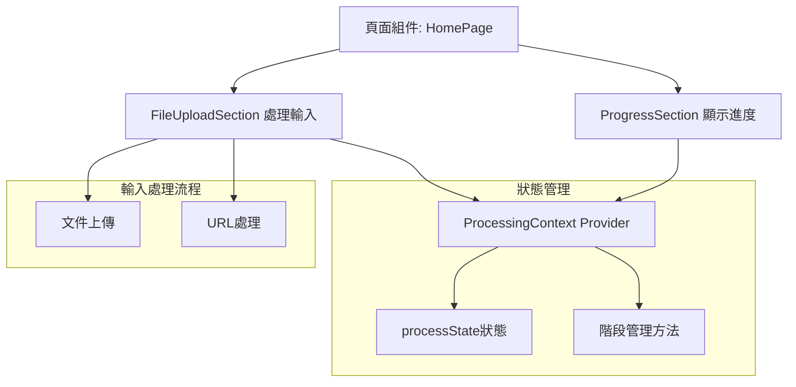
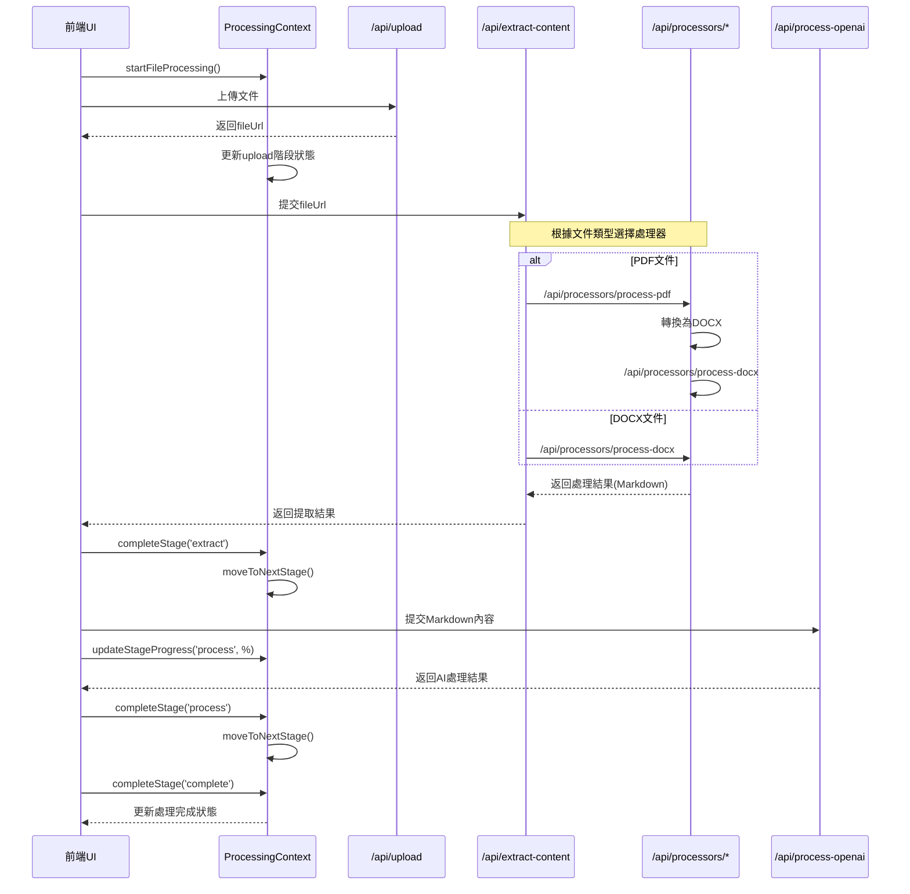
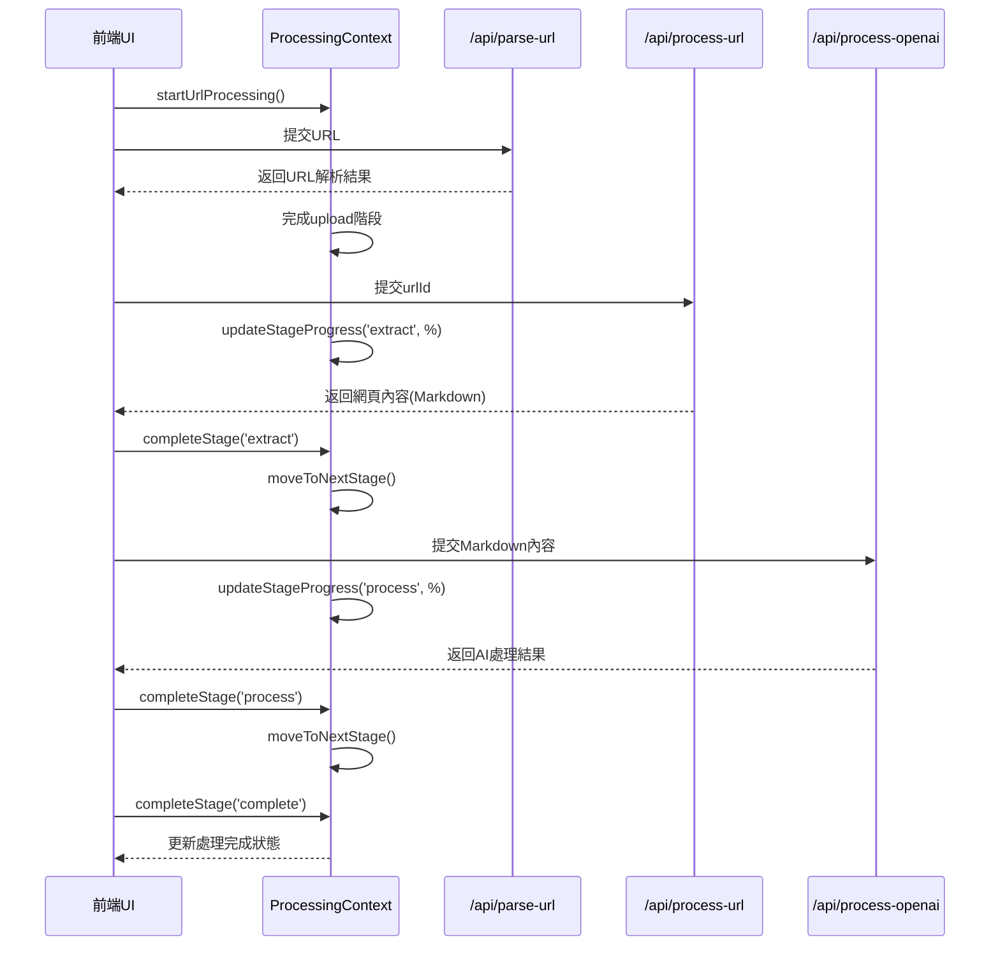
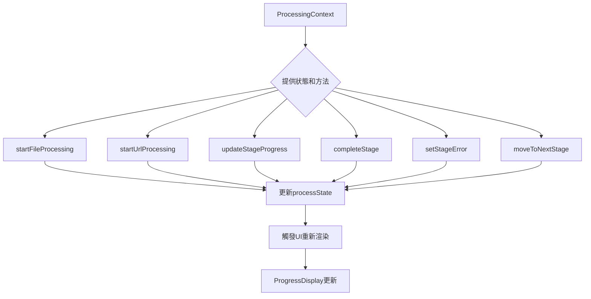

# 文件處理與進度顯示系統分析

## 1. 系統概述

系統設計採用React Context進行狀態管理，通過分層API架構處理文件和URL，並實時顯示處理進度。核心組件包括:

- **狀態管理**: `ProcessingContext` 管理所有處理階段的狀態
- **進度顯示**: `ProgressDisplay` 組件負責可視化處理進度
- **處理流程協調**: 分層API結構處理不同類型的輸入和處理階段

## 2. 處理流程階段

系統處理流程分為四個主要階段:

1. **上傳階段(upload)**: 處理文件上傳或URL解析
2. **提取階段(extract)**: 從文件或網頁中提取文本和圖片
3. **AI處理階段(process)**: 使用OpenAI進行AI Agent Editing
4. **完成階段(complete)**: 標記整個處理過程完成

每個階段都有四種可能的狀態: `pending` (等待處理)、`processing` (處理中)、`completed` (已完成)、`error` (錯誤)。

## 3. 流程圖解

### 系統架構和狀態流



### 文件處理流程



### URL處理流程



### 狀態管理內部邏輯



## 4. API架構分析

### 文件處理API層級

1. **上傳層**: `/api/upload` - 處理文件上傳並返回文件URL
2. **協調層**: `/api/extract-content` - 根據文件類型選擇適當的處理器
3. **處理器層**:
   - `/api/processors/process-pdf` - PDF文件處理
   - `/api/processors/process-docx` - DOCX文件處理
4. **AI處理層**: `/api/process-openai` - 使用OpenAI進行AI Agent Editing

### URL處理API層級

1. **解析層**: `/api/parse-url` - 解析URL並初始化處理
2. **處理層**: `/api/process-url` - 爬取和處理URL內容
3. **AI處理層**: `/api/process-openai` - 與文件處理共用同一API

## 5. 前端組件分析

### ProcessingContext提供的狀態和方法

- **狀態**:
  - `processState`: 包含完整的處理狀態信息
  - `stages`: 處理階段數組
  - `currentStage`: 當前處理階段
  - `overall`: 總體進度和狀態

- **方法**:
  - `startFileProcessing`: 初始化文件處理
  - `startUrlProcessing`: 初始化URL處理
  - `updateStageProgress`: 更新特定階段進度
  - `completeStage`: 完成特定階段
  - `setStageError`: 設置階段錯誤
  - `moveToNextStage`: 移動到下一階段

### 進度顯示組件

1. **ProgressSection**: 頁面中的進度區塊容器
2. **ProgressDisplay**: 詳細的進度和階段顯示組件
   - 顯示總體進度條
   - 顯示各階段狀態
   - 顯示處理元數據
3. **ProcessingProgress**: 更簡化的進度顯示組件(目前未使用)

## 6. 實現差異分析

### 計劃vs實際實現

計劃文檔中的階段設計與實際實現有差異:

| 計劃文檔階段 | 實際實現階段 |
|--------------|-------------|
| `uploading`, `extracting`, `AI Agent Editing`, `complete` | `upload`, `extract`, `process`, `complete` |

實際實現簡化了階段划分，將AI Agent Editing統一歸為一個`process`階段處理。

### 異常處理機制

系統實現了完整的錯誤處理機制:
- 階段錯誤狀態設置: `setStageError`
- 在UI中清晰顯示錯誤信息
- 提供部分錯誤恢復能力(例如跳過AI處理階段)

## 7. 處理流程對照表

| 階段 | PDF上傳流程 | DOCX上傳流程 | 一般URL | Google Docs URL | Medium文章 | WeChat公眾號 |
|------|------------|-------------|---------|----------------|------------|-------------|
| **upload** | • 上傳PDF文件<br>• 獲取fileUrl<br>• 更新上傳進度<br>• `/api/upload` | • 上傳DOCX文件<br>• 獲取fileUrl<br>• 更新上傳進度<br>• `/api/upload` | • 解析URL<br>• 存儲URL信息<br>• 生成urlId<br>• `/api/parse-url` | • 相同的URL解析<br>• 檢測為gdocs類型<br>• `/api/parse-url` | • 相同的URL解析<br>• 檢測為medium類型<br>• `/api/parse-url` | • 相同的URL解析<br>• 檢測為wechat類型<br>• `/api/parse-url` |
| **extract** | • PDF轉換為DOCX<br>• 提取文本和圖片<br>• 創建Markdown<br>• `/api/processors/process-pdf`<br>• 再轉到`/api/processors/process-docx` | • 直接提取DOCX文本和圖片<br>• 創建Markdown<br>• `/api/processors/process-docx` | • 網頁爬取<br>• 提取網頁內容<br>• 處理圖片<br>• 創建Markdown<br>• `/api/process-url` | • 使用特殊爬取方法<br>• 提取Google文檔結構<br>• `/api/process-url` | • 使用Medium專用爬取<br>• 處理Medium特定結構<br>• `/api/process-url` | • 處理微信公眾號登入牆<br>• 特殊提取微信內容<br>• `/api/process-url` |
| **process** | • AI Agent Editing<br>• 創建增強版Markdown<br>• `/api/process-openai` | • AI Agent Editing<br>• 創建增強版Markdown<br>• `/api/process-openai` | • AI Agent Editing<br>• 創建增強版Markdown<br>• `/api/process-openai` | • 與標準流程相同<br>• `/api/process-openai` | • 與標準流程相同<br>• `/api/process-openai` | • 與標準流程相同<br>• `/api/process-openai` |
| **complete** | • 保存最終Markdown<br>• 更新處理完成狀態<br>• 生成查看連結 | • 保存最終Markdown<br>• 更新處理完成狀態<br>• 生成查看連結 | • 保存最終Markdown<br>• 更新處理完成狀態<br>• 生成查看連結 | • 與標準流程相同 | • 與標準流程相同 | • 與標準流程相同 |

## 8. 改進建議

1. **進度更新與後端同步**:
   - 實現WebSocket或SSE進度更新機制
   - 為長時間處理任務提供更準確的進度報告

2. **錯誤恢復增強**:
   - 添加重試機制
   - 提供回退到特定階段的能力

3. **處理任務持久化**:
   - 添加任務ID和狀態持久化
   - 實現任務歷史和恢復功能

4. **進度顯示優化**:
   - 更詳細的階段進度信息
   - 更清晰的元數據顯示
   - 生成處理報告功能

5. **性能優化**:
   - 添加大文件分塊處理
   - 背景處理和通知機制

## 9. 極簡方案改進建議

### 當前進度顯示機制的問題

當前進度顯示機制存在的主要問題：

1. **基於假設的階段切換**：前端基於預設時間而非實際處理狀態切換階段
2. **沒有與後端狀態同步**：前端進度顯示與後端實際處理進度脫節
3. **針對不同類型的特殊處理**：需要為Google Docs等不同類型設置不同的計時器邏輯
4. **階段顯示不準確**：用戶看到的階段與實際處理階段可能不一致

關鍵問題範例(從 `FileUploadSection.tsx` 中提取)：

```javascript
// 提前顯示提取進度 - 模擬進度遞增
let extractProgress = 30;
extractInterval = setInterval(() => {
  extractProgress = Math.min(extractProgress + 10, 90);
  updateStageProgress('extract', extractProgress, '正在提取網頁內容...');
  
  // Google Docs處理通常較快進入AI階段
  if (isGoogleDocs && extractProgress >= 70) {
    // 根據預設時間判斷階段切換，而非真實處理狀態
    completeStage('extract', '網頁內容提取完成');
    moveToNextStage();
  }
}, isGoogleDocs ? 400 : 800); // 不同文件類型有不同計時器
```

### 極簡解決方案

極簡方案的核心思想：**讓API返回階段完成信息**，前端根據這些信息准確切換階段。

#### 主要差異對比

| 特性 | 當前方案 | 極簡方案 |
|------|---------|---------|
| **階段切換依據** | 基於預設時間 | 基於API返回的實際階段信息 |
| **前端/後端同步** | 無關聯 | 緊密同步 |
| **特殊類型處理** | 需要為不同類型設置不同計時器 | 統一處理，無需特殊邏輯 |
| **實施複雜度** | 前端簡單，但不准確 | 簡單修改API，保證準確性 |

### 需要修改的API

1. **`/api/process-url` 添加階段信息**：
   ```typescript
   // 修改前
   return NextResponse.json({
     success: true,
     urlId,
     markdownKey: markdownKey,
     publicUrl: publicUrl,
   });
   
   // 修改後
   return NextResponse.json({
     success: true,
     urlId,
     markdownKey: markdownKey,
     publicUrl: publicUrl,
     stage: 'extract',      // 添加：當前完成的階段
     stageComplete: true    // 添加：標記階段完成
   });
   ```

2. **`/api/process-openai` 添加階段信息**：
   ```typescript
   // 修改前
   return NextResponse.json({
     success: true,
     content: enhancedContent.substring(0, 200) + '...',
     markdownKey: r2Key,
     markdownUrl: localPath,
     publicUrl: publicUrl,
     fileId
   });
   
   // 修改後
   return NextResponse.json({
     success: true,
     content: enhancedContent.substring(0, 200) + '...',
     markdownKey: r2Key,
     markdownUrl: localPath,
     publicUrl: publicUrl,
     fileId,
     stage: 'process',      // 添加：當前完成的階段
     stageComplete: true    // 添加：標記階段完成
   });
   ```

### 前端修改

需要修改 `FileUploadSection.tsx` 的 `handleLinkSubmit` 方法：

```javascript
// 處理連結提交
const handleLinkSubmit = async () => {
  // 初始化設置保持不變
  startUrlProcessing(linkUrl, linkType);
  updateStageProgress('upload', 30, '正在處理URL...');
  
  const response = await fetch('/api/parse-url', {
    method: 'POST',
    headers: { 'Content-Type': 'application/json' },
    body: JSON.stringify({ url: linkUrl, type: linkType }),
  });
  
  const data = await response.json();
  
  // 完成第一階段
  completeStage('upload', 'URL解析完成');
  moveToNextStage();
  
  // 第二階段：可以保留進度動畫，但不再預設階段切換時機
  updateStageProgress('extract', 30, '正在提取網頁內容...');
  
  // 可以保留動畫進度，但不要提前切換階段
  let extractProgress = 30;
  extractInterval = setInterval(() => {
    extractProgress = Math.min(extractProgress + 10, 90);
    updateStageProgress('extract', extractProgress, '正在提取網頁內容...');
    // 移除基於時間的階段切換邏輯
  }, 800);
  
  // 等待API處理完成
  const processResponse = await fetch('/api/process-url', {
    method: 'POST',
    headers: { 'Content-Type': 'application/json' },
    body: JSON.stringify({ urlId: data.urlId }),
  });
  
  // 清理提取進度計時器
  if (extractInterval) clearInterval(extractInterval);
  extractInterval = null;
  
  const processResult = await processResponse.json();
  
  // 根據API返回的階段信息決定階段切換
  if (processResult.stageComplete && processResult.stage === 'extract') {
    updateStageProgress('extract', 100, '提取完成');
    completeStage('extract', '提取完成');
    moveToNextStage();
  }
  
  // AI處理階段
  updateStageProgress('process', 30, 'AI處理中...');
  
  // 類似的進度動畫
  let aiProgress = 30;
  aiInterval = setInterval(() => {
    aiProgress = Math.min(aiProgress + 5, 90);
    updateStageProgress('process', aiProgress, 'AI內容處理中...');
  }, 500);
  
  // 調用AI處理API
  const aiResponse = await fetch('/api/process-openai', {
    method: 'POST',
    headers: { 'Content-Type': 'application/json' },
    body: JSON.stringify({ 
      markdownKey: processResult.markdownKey,
      fileId: data.urlId 
    }),
  });
  
  // 清理AI進度計時器
  if (aiInterval) clearInterval(aiInterval);
  aiInterval = null;
  
  const aiResult = await aiResponse.json();
  
  // 根據API返回的階段信息決定階段切換
  if (aiResult.stageComplete && aiResult.stage === 'process') {
    updateStageProgress('process', 100, 'AI處理完成');
    completeStage('process', 'AI處理完成');
    moveToNextStage();
    
    // 完成最終階段
    completeStage('complete', '處理全部完成');
  }
};
```

### 實施步驟

1. **階段一：修改API返回值**
   - 修改 `/api/process-url` 添加階段信息
   - 修改 `/api/process-openai` 添加階段信息
   - 修改 `/api/processors/process-gdocs` 確保正確傳遞階段信息

2. **階段二：更新前端處理邏輯**
   - 修改 `FileUploadSection.tsx` 中的 `handleLinkSubmit` 函數
   - 移除基於時間的階段切換邏輯
   - 添加基於API返回值的階段切換邏輯

3. **階段三：統一其他流程**
   - 對檔案上傳流程進行類似修改
   - 確保所有處理流程使用相同的階段同步機制

### 結論

這種極簡方案只需最少的代碼修改，就能解決階段顯示不同步的問題。核心理念是讓前端UI基於實際的API響應來更新階段，而不是基於假設的時間間隔。這將大幅提高用戶體驗，特別是在處理複雜文檔和網頁時，用戶能看到真實的處理進度和階段。

## 10. 混合模式架構與當前系統問題分析

### 當前架構的核心問題

在分析系統實現後，發現存在核心架構不一致問題：

1. **文件上傳流程**：已經實現了良好的階段性流水線模式
   ```
   上傳文件 → [前端控制] → 提取內容 → [前端控制] → AI處理 → [前端控制] → 完成
   ```

2. **URL處理流程**：特別是Google Docs流程存在處理邏輯問題
   ```
   提交URL → [前端控制] → 處理URL(內容提取+AI處理的後端自動流水線) → [輪詢] → 完成
   ```

主要問題在於：**URL處理中將內容提取(extract)和AI處理(process)兩個獨立階段錯誤地合併成一個流水線**，導致：
- 階段切換不清晰，前端無法準確知道當前處理階段
- 被迫實現複雜的輪詢機制查詢狀態
- 處理邏輯與文件上傳流程不一致，維護困難
- 無法實現用戶在階段間的干預（如在AI處理前調整內容）

### 正確的混合模式架構

應採用**階段性流水線混合模式**，在整個系統中統一實現：

```
輸入(文件/URL) → [階段完成，前端控制] → 內容提取 → [階段完成，前端控制] → AI處理 → [階段完成，前端控制] → 完成
```

這種模式的優勢：
1. **明確的階段邊界**：每個處理階段有明確的開始和結束點
2. **統一的用戶體驗**：文件和URL處理有一致的階段進展顯示
3. **允許用戶干預**：在階段間可以添加用戶確認或編輯環節
4. **簡化的前端邏輯**：不需要複雜的輪詢機制，前端可以主動控制流程
5. **更好的錯誤恢復**：每個階段可以獨立處理和恢復

### URL處理流程修正方案

具體修正Google Docs和其他URL處理流程的方法：

1. **APIs修改**:
   - **分離階段處理**：`/api/process-url`只處理內容提取，不自動觸發AI處理
   - **清晰的狀態返回**：每個API明確返回階段完成狀態(`stage`, `stageComplete`)
   - **保持處理中間狀態**：階段間保存處理狀態，允許前端控制流程進展

2. **處理流程修改**：
   ```javascript
   // Google Docs URL處理修正邏輯
   // 1. process-url/route.ts修改
   // 將這段代碼：
   const scrapedData = await scrapeWithFireScrawl(urlInfo.url, urlInfo.type, metadata);
   if (scrapedData.metadata.markdownKey) {
     // 直接調用AI處理API
     const aiResponse = await fetch(getApiUrl('/api/process-openai'), {
       method: 'POST',
       body: JSON.stringify({
         markdownKey: scrapedData.metadata.markdownKey,
         fileId: urlId
       }),
     });
     // 返回AI處理結果
   }
   
   // 修改為：
   const scrapedData = await scrapeWithFireScrawl(urlInfo.url, urlInfo.type, metadata);
   if (scrapedData.metadata.markdownKey) {
     // 僅返回內容提取結果，不自動調用AI處理
     return NextResponse.json({
       success: true,
       urlId,
       markdownKey: scrapedData.metadata.markdownKey,
       publicUrl: scrapedData.metadata.publicUrl,
       status: 'content-extracted',
       stage: 'extract',
       stageComplete: true,
       metadata: {
         title: scrapedData.title,
         language: scrapedData.metadata.language,
         wordCount: scrapedData.metadata.wordCount,
         // 其他元數據...
       }
     });
   }
   ```

3. **前端流程統一**:
   - 移除URL處理中的輪詢機制
   - 使用與文件上傳相同的階段控制模式
   - 為所有流程使用相同的階段轉換邏輯

### 實施路線圖

1. **階段一：API分離**
   - 修改`/api/process-url`，移除自動AI處理流程
   - 確保所有API返回統一的階段完成信息

2. **階段二：前端統一**
   - 更新`FileUploadSection.tsx`的URL處理邏輯
   - 移除輪詢機制，改為與文件上傳相同的前端控制流程
   - 確保階段轉換邏輯一致

3. **階段三：用戶干預能力（可選）**
   - 添加階段間的用戶確認機制
   - 實現內容提取後的編輯能力
   - 添加取消或跳過特定階段的選項

### 結論

統一採用階段性流水線混合模式，將使系統架構更加清晰、一致，並為未來的功能擴展（如用戶干預）奠定基礎。這種改進不僅解決了當前的同步問題，還提高了系統的可維護性和擴展性。
