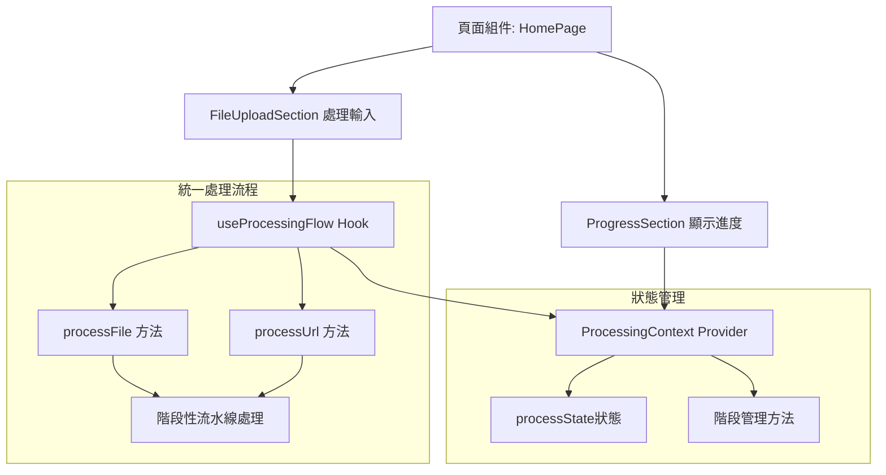
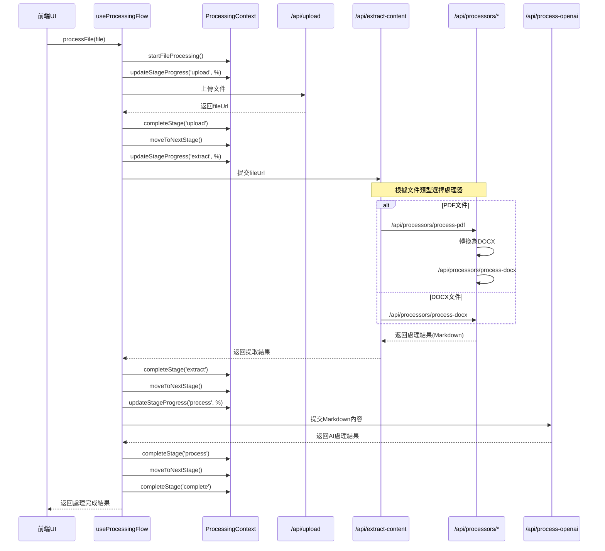
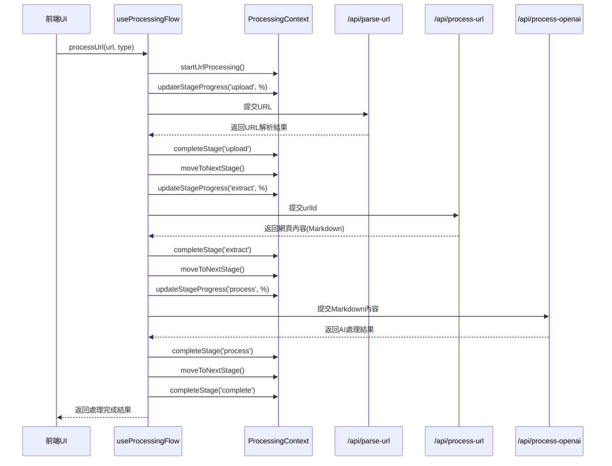
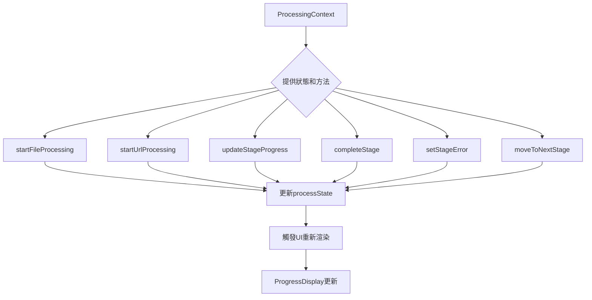

# 文件處理與進度顯示系統分析

## 1. 系統概述

系統設計採用React Context進行狀態管理，通過統一處理流程管理器處理文件和URL，並實時顯示處理進度。核心組件包括:

- **狀態管理**: `ProcessingContext` 管理所有處理階段的狀態
- **流程管理**: `useProcessingFlow` Hook統一協調處理流程
- **進度顯示**: `ProgressDisplay` 組件負責可視化處理進度
- **處理流程協調**: 階段性流水線混合模式處理不同類型的輸入

## 2. 處理流程階段

系統處理流程分為四個主要階段:

1. **上傳階段(upload)**: 處理文件上傳或URL解析
2. **提取階段(extract)**: 從文件或網頁中提取文本和圖片
3. **AI處理階段(process)**: 使用OpenAI進行AI Agent Editing
4. **完成階段(complete)**: 標記整個處理過程完成

每個階段都有四種可能的狀態: `pending` (等待處理)、`processing` (處理中)、`completed` (已完成)、`error` (錯誤)。

## 3. 流程圖解

### 系統架構和狀態流



### 文件處理流程



### URL處理流程



### 狀態管理內部邏輯



## 4. API架構分析

### 文件處理API層級

1. **上傳層**: `/api/upload` - 處理文件上傳並返回文件URL
2. **協調層**: `/api/extract-content` - 根據文件類型選擇適當的處理器
3. **處理器層**:
   - `/api/processors/process-pdf` - PDF文件處理
   - `/api/processors/process-docx` - DOCX文件處理
4. **AI處理層**: `/api/process-openai` - 使用OpenAI進行AI Agent Editing

### URL處理API層級

1. **解析層**: `/api/parse-url` - 解析URL並初始化處理
2. **處理層**: `/api/process-url` - 爬取和處理URL內容
3. **AI處理層**: `/api/process-openai` - 與文件處理共用同一API

## 5. 前端組件分析

### ProcessingContext提供的狀態和方法

- **狀態**:
  - `processState`: 包含完整的處理狀態信息
  - `stages`: 處理階段數組
  - `currentStage`: 當前處理階段
  - `overall`: 總體進度和狀態

- **方法**:
  - `startFileProcessing`: 初始化文件處理
  - `startUrlProcessing`: 初始化URL處理
  - `updateStageProgress`: 更新特定階段進度
  - `completeStage`: 完成特定階段
  - `setStageError`: 設置階段錯誤
  - `moveToNextStage`: 移動到下一階段

### 統一處理流程管理器

`useProcessingFlow` Hook集中管理所有處理流程，提供以下功能:

- **主要方法**:
  - `processFile`: 統一處理文件上傳流程
  - `processUrl`: 統一處理URL處理流程
  - `cleanup`: 清理資源和定時器

- **內部處理方法**:
  - `processFileUpload`: 處理文件上傳階段
  - `processUrlSubmit`: 處理URL提交階段
  - `processFileExtraction`: 處理文件內容提取階段
  - `processUrlExtraction`: 處理URL內容提取階段
  - `processAiEnhancement`: 處理AI增強階段

### 進度顯示組件

1. **ProgressSection**: 頁面中的進度區塊容器
2. **ProgressDisplay**: 詳細的進度和階段顯示組件
   - 顯示總體進度條
   - 顯示各階段狀態
   - 顯示處理元數據
3. **ProcessingProgress**: 更簡化的進度顯示組件(目前未使用)

### 異常處理機制

系統實現了完整的錯誤處理機制:
- 階段錯誤狀態設置: `setStageError`
- 在UI中清晰顯示錯誤信息
- 提供部分錯誤恢復能力(例如跳過AI處理階段)

## 7. 處理流程對照表

| 階段 | PDF上傳流程 | DOCX上傳流程 | 一般URL | Google Docs URL | Medium文章 | WeChat公眾號 |
|------|------------|-------------|---------|----------------|------------|-------------|
| **upload** | • 上傳PDF文件<br>• 獲取fileUrl<br>• 更新上傳進度<br>• `/api/upload` | • 上傳DOCX文件<br>• 獲取fileUrl<br>• 更新上傳進度<br>• `/api/upload` | • 解析URL<br>• 存儲URL信息<br>• 生成urlId<br>• `/api/parse-url` | • 相同的URL解析<br>• 檢測為gdocs類型<br>• `/api/parse-url` | • 相同的URL解析<br>• 檢測為medium類型<br>• `/api/parse-url` | • 相同的URL解析<br>• 檢測為wechat類型<br>• `/api/parse-url` |
| **extract** | • PDF轉換為DOCX<br>• 提取文本和圖片<br>• 創建Markdown<br>• `/api/processors/process-pdf`<br>• 再轉到`/api/processors/process-docx` | • 直接提取DOCX文本和圖片<br>• 創建Markdown<br>• `/api/processors/process-docx` | • 網頁爬取<br>• 提取網頁內容<br>• 處理圖片<br>• 創建Markdown<br>• `/api/process-url` | • 使用特殊爬取方法<br>• 提取Google文檔結構<br>• `/api/process-url` | • 使用Medium專用爬取<br>• 處理Medium特定結構<br>• `/api/process-url` | • 處理微信公眾號登入牆<br>• 特殊提取微信內容<br>• `/api/process-url` |
| **process** | • AI Agent Editing<br>• 創建增強版Markdown<br>• `/api/process-openai` | • AI Agent Editing<br>• 創建增強版Markdown<br>• `/api/process-openai` | • AI Agent Editing<br>• 創建增強版Markdown<br>• `/api/process-openai` | • 與標準流程相同<br>• `/api/process-openai` | • 與標準流程相同<br>• `/api/process-openai` | • 與標準流程相同<br>• `/api/process-openai` |
| **complete** | • 保存最終Markdown<br>• 更新處理完成狀態<br>• 生成查看連結 | • 保存最終Markdown<br>• 更新處理完成狀態<br>• 生成查看連結 | • 保存最終Markdown<br>• 更新處理完成狀態<br>• 生成查看連結 | • 與標準流程相同 | • 與標準流程相同 | • 與標準流程相同 |

## 9. 階段性流水線混合模式的實現

### 當前系統架構

系統採用統一的**階段性流水線混合模式**：

```
輸入(文件/URL) → [階段完成，前端控制] → 內容提取 → [階段完成，前端控制] → AI處理 → [階段完成，前端控制] → 完成
```

通過`useProcessingFlow` Hook統一管理所有處理流程，實現：

1. **明確的階段邊界**：每個處理階段有明確的開始和結束點
2. **統一的用戶體驗**：文件和URL處理有一致的階段進展顯示
3. **允許用戶干預**：在階段間可以添加用戶確認或編輯環節
4. **簡化的前端邏輯**：不需要複雜的輪詢機制，前端可以主動控制流程
5. **更好的錯誤恢復**：每個階段可以獨立處理和恢復

### 前端階段控制機制

階段性流水線混合模式的核心是前端對處理階段的精確控制。這是通過以下核心函數實現的：

1. **`completeStage(stageId, message)`**
   - 作用：標記特定階段已完成
   - 參數：
     - `stageId`: 階段ID (例如 'upload', 'extract', 'process')
     - `message`: 完成時的狀態消息
   - 行為：將階段狀態更新為 `completed`，並設置完成消息

2. **`moveToNextStage()`**
   - 作用：將當前活動階段移動到下一個階段
   - 行為：將下一個階段的狀態從 `pending` 改為 `processing`
   - 時機：通常在 `completeStage()` 調用後立即調用

3. **`updateStageProgress(stageId, percentage, message)`**
   - 作用：更新特定階段的進度百分比
   - 參數：
     - `stageId`: 階段ID
     - `percentage`: 完成百分比 (0-100)
     - `message`: 進度描述消息
   - 行為：更新階段進度顯示，但不改變階段狀態

4. **`setStageError(stageId, errorMessage)`**
   - 作用：將特定階段標記為錯誤狀態
   - 參數：
     - `stageId`: 階段ID
     - `errorMessage`: 錯誤消息
   - 行為：將階段狀態更新為 `error`，並記錄錯誤消息

## 10. 混合模式架構的模組化實現

系統採用統一處理流程管理器`useProcessingFlow`，將各處理階段邏輯封裝為獨立函數：

1. **processFileUpload/processUrlSubmit**：處理上傳階段邏輯
   - 負責文件上傳或URL解析
   - 使用 `completeStage('upload')` 和 `moveToNextStage()` 完成階段切換
   - 返回上傳/解析結果供後續階段使用

2. **processFileExtraction/processUrlExtraction**：處理內容提取階段邏輯
   - 負責從文件或URL提取內容
   - 使用 `completeStage('extract')` 和 `moveToNextStage()` 完成階段切換
   - 返回提取結果供AI處理階段使用

3. **processAiEnhancement**：處理AI處理階段邏輯
   - 負責AI增強內容
   - 使用 `completeStage('process')` 和 `completeStage('complete')` 完成流程
   - 返回最終處理結果

這種模組化設計的優勢：
- **關注點分離**：每個函數只負責特定階段的邏輯
- **可測試性**：每個階段可以獨立測試
- **可維護性**：修改特定階段邏輯不影響其他階段
- **可重用性**：不同輸入類型可以重用相同的階段處理邏輯
- **擴展性**：易於在階段之間添加用戶干預步驟

## 11. 性能優化與架構改進

### 統一處理流程管理器的優化

`useProcessingFlow` Hook實現了以下性能優化：

1. **減少狀態更新和渲染循環**：
   - 移除了多餘的狀態存儲和更新
   - 避免了通過狀態變化觸發useEffect造成的性能損失
   - 使用更直接的函數調用流程替代狀態變化通知

2. **優化函數引用穩定性**：
   - 使用useCallback保證函數引用穩定
   - 避免不必要的依賴項變化導致的效能問題
   - 參數化所有回調函數，減少閉包引用

3. **流程協調機制改進**：
   - 使用串行直接調用替代輪詢機制
   - 各處理階段可直接傳遞結果給下一階段
   - 階段間界限清晰，同時減少了狀態存儲需求

### 實現對比

| 原始實現 | 改進實現 |
|---------|---------|
| 使用多個獨立hooks | 使用單一統一管理器hook |
| 通過狀態變化觸發階段切換 | 通過函數直接調用進行階段切換 |
| 使用輪詢機制查詢處理狀態 | 使用串行同步處理流程 |
| 組件代碼與流程邏輯混合 | 完全分離視圖邏輯和業務邏輯 |

### 效能提升

1. **更快的響應速度**：由於避免了多餘的狀態更新和渲染循環，處理流程更加流暢

2. **更少的內存佔用**：減少了狀態存儲和組件重渲染次數

3. **更清晰的錯誤處理**：統一的錯誤處理機制，錯誤可被準確定位到特定階段

4. **更好的擴展性**：
   - 可輕鬆插入新的處理階段
   - 可在不同階段間添加用戶干預步驟
   - 提供統一的回調機制便於外部整合

### API兼容性
重構實現完全保持了原有API的兼容性，所有後端API的接口和功能保持不變，確保：

1. 系統可以通過API直接調用，不依賴於前端界面
2. 原有的自動化流程和整合方案可以繼續運作
3. 未來可以輕鬆添加新的前端界面或後端服務

這種改進使系統同時獲得了良好的用戶體驗和API整合能力，既可以作為獨立應用運行，也可以作為服務被其他系統調用。
