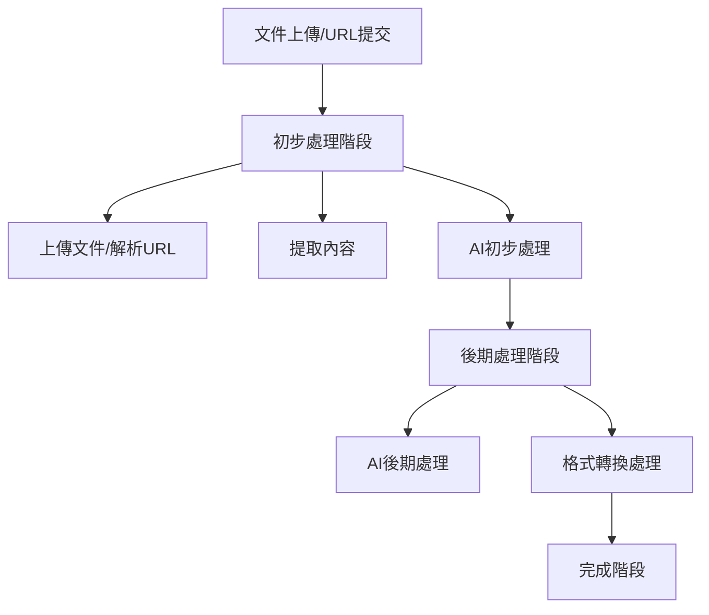
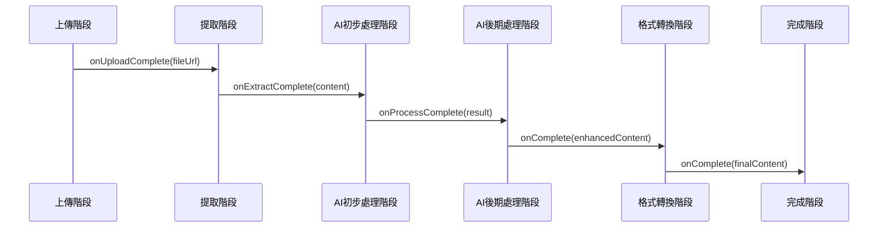

# 處理流程擴展計劃：增加後期處理階段

## 1. 概述

本文檔詳細說明如何擴展現有的處理流程架構，增加"後期處理階段"，使整體流程變為：
1. **初步處理階段**（現有）：上傳(upload)、提取(extract)、AI處理(process)
2. **後期處理階段**（新增）：進階AI處理(advanced-ai)、格式轉換(format-conversion)
3. **完成階段**（現有）：complete

擴展方案將保持現有的直接回調串聯架構，同時通過階段群組概念實現清晰的流程分類。

## 2. 架構調整方案

### 2.1 階段定義擴展

擴展 ProcessingContext 中的階段定義：

```typescript
// 擴展階段類型
type ProcessStage = 
  // 初步處理階段
  | 'upload' | 'extract' | 'process' 
  // 後期處理階段
  | 'advanced-ai' | 'format-conversion' 
  // 最終階段
  | 'complete';

// 新增階段配置
const newStages = [
  { id: 'advanced-ai', name: 'AI 後期處理', group: 'advanced' },
  { id: 'format-conversion', name: '格式轉換處理', group: 'advanced' }
];

// 階段群組定義
const stageGroups = {
  initial: { 
    title: "初步處理階段",
    stages: ['upload', 'extract', 'process']
  },
  advanced: { 
    title: "後期處理階段",
    stages: ['advanced-ai', 'format-conversion']
  },
  final: {
    title: "完成階段", 
    stages: ['complete']
  }
};
```

### 2.2 新增階段處理 Hooks

創建兩個新的專門階段處理 Hook：

```typescript
// 後期AI處理Hook
function useAdvancedAiStage(context, { onComplete }) {
  const startAdvancedAiProcessing = useCallback(async (content) => {
    try {
      context.updateStageProgress('advanced-ai', 0);
      
      // 呼叫後期AI處理API
      const response = await fetch('/api/advanced-ai-processing', {
        method: 'POST',
        headers: { 'Content-Type': 'application/json' },
        body: JSON.stringify({ 
          content,
          options: { /* 可能的處理選項 */ }
        })
      });
      
      if (!response.ok) {
        throw new Error('後期AI處理失敗');
      }
      
      const result = await response.json();
      context.updateStageProgress('advanced-ai', 100);
      context.completeStage('advanced-ai');
      
      if (onComplete) {
        onComplete(result);
      }
      
      return result;
    } catch (error) {
      context.setStageError('advanced-ai', error.message);
      console.error('後期AI處理錯誤:', error);
      throw error;
    }
  }, [context, onComplete]);
  
  const cleanup = useCallback(() => {
    // 清理資源
  }, []);
  
  return {
    startAdvancedAiProcessing,
    cleanup
  };
}

// 格式轉換處理Hook
function useFormatConversionStage(context, { onComplete }) {
  const startFormatConversion = useCallback(async (content) => {
    try {
      context.updateStageProgress('format-conversion', 0);
      
      // 呼叫格式轉換API
      const response = await fetch('/api/format-conversion', {
        method: 'POST',
        headers: { 'Content-Type': 'application/json' },
        body: JSON.stringify({ 
          content,
          format: 'html' // 或其他目標格式
        })
      });
      
      if (!response.ok) {
        throw new Error('格式轉換處理失敗');
      }
      
      const result = await response.json();
      context.updateStageProgress('format-conversion', 100);
      context.completeStage('format-conversion');
      
      if (onComplete) {
        onComplete(result);
      }
      
      return result;
    } catch (error) {
      context.setStageError('format-conversion', error.message);
      console.error('格式轉換處理錯誤:', error);
      throw error;
    }
  }, [context, onComplete]);
  
  const cleanup = useCallback(() => {
    // 清理資源
  }, []);
  
  return {
    startFormatConversion,
    cleanup
  };
}
```

### 2.3 擴展流程協調器

修改 useProcessingFlow 以包含新階段：

```typescript
function useProcessingFlow() {
  // 引入 ProcessingContext
  const context = useContext(ProcessingContext);
  
  // 建立階段引用
  const advancedAiStageRef = useRef(null);
  const formatConversionStageRef = useRef(null);
  
  // 初始化後期處理階段
  const advancedAiStage = useAdvancedAiStage(context, {
    onComplete: (result) => {
      if (formatConversionStageRef.current) {
        formatConversionStageRef.current.startFormatConversion(result);
      }
    }
  });
  
  const formatConversionStage = useFormatConversionStage(context, {
    onComplete: (result) => {
      context.completeStage('complete');
      return result;
    }
  });
  
  // 保存階段引用
  useEffect(() => {
    advancedAiStageRef.current = advancedAiStage;
    formatConversionStageRef.current = formatConversionStage;
    
    return () => {
      // 清理所有階段資源
      advancedAiStage.cleanup();
      formatConversionStage.cleanup();
    };
  }, [advancedAiStage, formatConversionStage]);
  
  // 修改現有AI處理階段回調
  const aiProcessingStage = useAiProcessingStage(context, {
    onProcessComplete: (result) => {
      // 完成初步AI處理階段
      context.completeStage('process');
      
      // 進入後期處理流程
      if (advancedAiStageRef.current) {
        advancedAiStageRef.current.startAdvancedAiProcessing(result);
      }
      
      return result;
    }
  });
  
  // 其他現有階段保持不變
  // ...
  
  // 返回公開方法
  return {
    processFile,
    processUrl,
    cleanup: () => {
      // 確保所有階段資源都被清理
      // ...現有清理邏輯
      advancedAiStage.cleanup();
      formatConversionStage.cleanup();
    }
  };
}
```

## 3. API 擴展

需要創建兩個新的 API 端點：

### 3.1 後期 AI 處理 API

```typescript
// /api/advanced-ai-processing/route.ts
import { NextResponse } from 'next/server';

export async function POST(req: Request) {
  try {
    const { content, options } = await req.json();
    
    // 實現後期AI處理邏輯
    // 例如：更複雜的內容增強、智能摘要生成等
    
    const enhancedContent = await processWithAdvancedAI(content, options);
    
    return NextResponse.json({
      success: true,
      content: enhancedContent
    });
  } catch (error) {
    console.error('後期AI處理錯誤:', error);
    return NextResponse.json(
      { success: false, error: error.message },
      { status: 500 }
    );
  }
}
```

### 3.2 格式轉換 API

```typescript
// /api/format-conversion/route.ts
import { NextResponse } from 'next/server';

export async function POST(req: Request) {
  try {
    const { content, format } = await req.json();
    
    // 實現格式轉換邏輯
    // 例如：Markdown 轉 HTML、應用自定義模板等
    
    const convertedContent = await convertFormat(content, format);
    
    return NextResponse.json({
      success: true,
      content: convertedContent,
      format: format
    });
  } catch (error) {
    console.error('格式轉換錯誤:', error);
    return NextResponse.json(
      { success: false, error: error.message },
      { status: 500 }
    );
  }
}
```

## 4. 前端顯示調整

### 4.1 修改 ProgressDisplay 組件

更新 ProgressDisplay 組件以支持階段群組顯示：

```tsx
function ProgressDisplay({ processState, stageGroups }) {
  const { stages, currentStage, overall } = processState;
  
  return (
    <div className="space-y-6">
      {/* 總體進度條 */}
      <div className="space-y-2">
        <div className="flex justify-between text-sm">
          <span>總體進度</span>
          <span>{overall.progress}%</span>
        </div>
        <div className="h-2 bg-gray-200 rounded-full overflow-hidden">
          <div 
            className="h-full bg-primary-500 transition-all" 
            style={{ width: `${overall.progress}%` }}
          ></div>
        </div>
      </div>
      
      {/* 階段群組顯示 */}
      {Object.entries(stageGroups).map(([groupId, group]) => (
        <div key={groupId} className="space-y-4">
          <h3 className="text-lg font-medium">{group.title}</h3>
          
          <div className="space-y-3 pl-4">
            {group.stages.map(stageId => {
              const stage = stages.find(s => s.id === stageId);
              if (!stage) return null;
              
              return (
                <div key={stage.id} className="flex items-center space-x-3">
                  <StageStatusIcon status={stage.status} />
                  <div className="flex-1">
                    <div className="flex justify-between text-sm">
                      <span>{stage.name}</span>
                      <span>{stage.progress}%</span>
                    </div>
                    <div className="h-1.5 bg-gray-200 rounded-full overflow-hidden">
                      <div 
                        className={`h-full transition-all ${
                          stage.status === 'error' ? 'bg-red-500' : 'bg-primary-500'
                        }`}
                        style={{ width: `${stage.progress}%` }}
                      ></div>
                    </div>
                  </div>
                </div>
              );
            })}
          </div>
        </div>
      ))}
      
      {/* 處理信息 */}
      {processState.metadata && (
        <div className="bg-gray-50 p-3 rounded text-sm">
          <p className="font-medium">處理信息:</p>
          <pre className="text-xs mt-1 overflow-x-auto">
            {JSON.stringify(processState.metadata, null, 2)}
          </pre>
        </div>
      )}
    </div>
  );
}

// 階段狀態圖標組件
function StageStatusIcon({ status }) {
  switch (status) {
    case 'completed':
      return <CheckCircleIcon className="w-5 h-5 text-green-500" />;
    case 'processing':
      return <SpinnerIcon className="w-5 h-5 text-blue-500 animate-spin" />;
    case 'error':
      return <XCircleIcon className="w-5 h-5 text-red-500" />;
    default:
      return <CircleIcon className="w-5 h-5 text-gray-300" />;
  }
}
```

### 4.2 更新 ProcessingContext 提供者

修改 ProcessingProvider 以支持階段群組配置：

```tsx
function ProcessingProvider({ children }) {
  // 定義階段群組
  const stageGroups = {
    initial: { 
      title: "初步處理階段",
      stages: ['upload', 'extract', 'process']
    },
    advanced: { 
      title: "後期處理階段",
      stages: ['advanced-ai', 'format-conversion']
    },
    final: {
      title: "完成階段", 
      stages: ['complete']
    }
  };

  // 定義所有階段
  const allStages = [
    { id: 'upload', name: '上傳文件', group: 'initial' },
    { id: 'extract', name: '提取內容', group: 'initial' },
    { id: 'process', name: 'AI 初步處理', group: 'initial' },
    { id: 'advanced-ai', name: 'AI 後期處理', group: 'advanced' },
    { id: 'format-conversion', name: '格式轉換處理', group: 'advanced' },
    { id: 'complete', name: '處理完成', group: 'final' }
  ];
  
  // 初始化處理狀態
  const [processState, setProcessState] = useState({
    stages: allStages.map(stage => ({
      ...stage,
      status: 'pending',
      progress: 0,
      error: null
    })),
    currentStage: null,
    overall: {
      status: 'pending',
      progress: 0
    },
    metadata: null
  });
  
  // ... 其他現有邏輯
  
  return (
    <ProcessingContext.Provider 
      value={{ 
        processState, 
        stageGroups,
        startFileProcessing,
        startUrlProcessing,
        updateStageProgress,
        completeStage,
        setStageError
        // ... 其他方法
      }}
    >
      {children}
    </ProcessingContext.Provider>
  );
}
```

### 4.3 更新 ProgressSection 組件

```tsx
function ProgressSection() {
  const { processState, stageGroups } = useContext(ProcessingContext);
  
  return (
    <div className="space-y-6">
      <div className="flex items-center justify-between">
        <h2 className="text-xl font-bold">處理進度</h2>
        <div className="text-sm text-gray-500">
          {processState.overall.status === 'completed' 
            ? '處理完成' 
            : processState.overall.status === 'processing'
              ? '處理中...'
              : '等待開始'}
        </div>
      </div>
      
      <ProgressDisplay 
        processState={processState}
        stageGroups={stageGroups}
      />
    </div>
  );
}
```

## 9. 實現進度

### 9.1 已完成項目

截至目前，我們已經完成以下擴展實現：

1. **ProcessingContext 擴展**
   - ✅ 擴展階段定義，添加 'advanced-ai' 和 'format-conversion' 階段
   - ✅ 實現階段群組配置，將處理流程分為初步處理、後期處理和完成階段
   - ✅ 更新階段顯示和進度管理

2. **處理階段 Hook 實現**
   - ✅ 實現 `useAdvancedAiStage` Hook 處理 PR writer 階段
   - ✅ 實現 `useFormatConversionStage` Hook 處理格式轉換階段
   - ✅ 整合新階段到處理流程中

3. **API 端點實現**
   - ✅ 實現 `/api/advanced-ai-processing` 後期 AI 處理 API
   - ✅ 實現 `/api/format-conversion` 格式轉換 API

4. **UI 更新**
   - ✅ 重構 `ProgressDisplay` 組件支持階段群組顯示
   - ✅ 實現分頁式處理流程顯示（初步處理、後期處理、結果查看）
   - ✅ 優化階段結果查看，修復查看按鈕直接在新窗口打開結果的行為

5. **功能改進**
   - ✅ 使用 marked 庫實現 Markdown 轉 HTML 功能
   - ✅ 優化錯誤處理和恢復機制

### 9.2 待解決問題

在實現過程中發現的一些問題：

1. **PR writer agent 模擬**
   - 當前 PR writer 處理僅是模擬，沒有實際實現專門的 PR writer agent
   - 需要基於現有 agent 架構開發真正的 PR writer 功能

2. **UI 互動優化**
   - 分段處理流程的 UI 需要進一步優化，特別是階段間的過渡效果
   - 提供更清晰的處理狀態反饋

### 9.3 下一步計劃

1. **PR writer agent 完整實現**
   - 開發基於 OpenAI API 的專門 PR writer agent
   - 實現新聞稿專業性增強功能

2. **UI/UX 優化**
   - 改進處理流程的視覺反饋
   - 優化移動端體驗

3. **性能優化**
   - 優化大文件處理性能
   - 改進並行處理能力

## 5. 流程圖解

擴展後的處理流程：



階段串聯關係：



## 6. 實施步驟

1. **擴展 ProcessingContext**
   - 更新階段定義
   - 添加階段群組配置
   - 擴展進度計算邏輯

2. **創建新的 API 端點**
   - 實現 `/api/advanced-ai-processing`
   - 實現 `/api/format-conversion`

3. **開發專門階段處理 Hooks**
   - 實現 `useAdvancedAiStage`
   - 實現 `useFormatConversionStage`

4. **更新協調器**
   - 修改 `useProcessingFlow` 添加新階段
   - 調整階段串聯邏輯

5. **更新前端顯示**
   - 重構 `ProgressDisplay` 支持階段群組
   - 更新 `ProgressSection` 顯示邏輯

6. **測試和調優**
   - 單元測試新階段Hooks
   - 整合測試完整流程
   - 性能測試階段過渡

## 7. 注意事項

1. **向後相容**
   - 確保舊的API仍然可用
   - 提供過渡機制

2. **錯誤處理**
   - 每個新階段都必須有完整的錯誤處理
   - 支持跳過特定階段的機制

3. **性能考量**
   - 確保新階段不會顯著增加處理時間
   - 考慮添加可選的階段跳過選項

4. **用戶體驗**
   - 提供清晰的進度反饋
   - 考慮添加取消長時間運行處理的選項

## 8. 未來擴展

本架構設計支持未來繼續擴展更多處理階段：

1. **預處理階段**: 在上傳前添加初步處理
2. **分支處理**: 根據內容類型選擇不同的處理路徑
3. **並行處理**: 同時執行多個非依賴的處理階段
4. **用戶干預**: 在特定階段添加用戶確認或編輯步驟

通過保持模組化設計和直接回調串聯機制，可以輕鬆實現這些擴展而不需要大規模重構。 