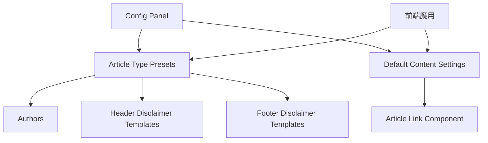

# Strapi 5 架構設計文件

## 📋 **架構概述**

當前 Strapi 5 系統採用組合式配置設計，支援靈活的內容管理：
- **基礎元件**：Authors, Header Disclaimers, Footer Disclaimers
- **組合配置**：Article Type Presets
- **預設內容**：Default Content Settings

---

## 🏗️ **核心內容類型**

### **1. Authors (基礎元件)**

**用途**：管理文章作者資訊
**類型**：Collection Type
**狀態**：✅ 已實現

```json
{
  "kind": "collectionType",
  "collectionName": "authors",
  "info": {
    "singularName": "author",
    "pluralName": "authors",
    "displayName": "Authors",
    "description": "文章作者管理"
  },
  "attributes": {
    "name": {
      "type": "string",
      "required": true,
      "unique": true,
      "description": "作者帳號名稱，例：BTEditor"
    },
    "displayName": {
      "type": "string", 
      "required": true,
      "description": "作者顯示名稱，例：廣編頻道（BTEditor）"
    },
    "wordpressId": {
      "type": "integer",
      "description": "WordPress 系統中的作者 ID"
    },
    "department": {
      "type": "string",
      "description": "所屬部門，例：BTEditor, BTVerse"
    },
    "description": {
      "type": "text",
      "description": "作者簡介"
    },
    "isActive": {
      "type": "boolean",
      "default": true,
      "description": "是否啟用"
    }
  }
}
```

### **2. Header Disclaimer Templates (基礎元件)**

**用途**：管理文章開頭押註模板
**類型**：Collection Type
**狀態**：✅ 已實現

```json
{
  "kind": "collectionType",
  "collectionName": "header_disclaimer_templates",
  "info": {
    "singularName": "header-disclaimer-template",
    "pluralName": "header-disclaimer-templates",
    "displayName": "Header Disclaimer Templates",
    "description": "文章開頭押註模板管理"
  },
  "attributes": {
    "name": {
      "type": "string",
      "required": true,
      "unique": true,
      "description": "系統識別碼，例：sponsored, press-release, none"
    },
    "displayName": {
      "type": "string",
      "required": true,
      "description": "顯示名稱，例：廣編稿開頭押註"
    },
    "template": {
      "type": "richtext",
      "required": true,
      "description": "HTML 模板內容，支援變數替換 ［撰稿方名稱］"
    },
    "description": {
      "type": "text",
      "description": "模板說明"
    },
    "isSystemDefault": {
      "type": "boolean",
      "default": false,
      "description": "系統預設項目，不可刪除"
    },
    "isActive": {
      "type": "boolean",
      "default": true,
      "description": "是否啟用"
    }
  }
}
```

### **3. Footer Disclaimer Templates (基礎元件)**

**用途**：管理文章末尾押註模板
**類型**：Collection Type
**狀態**：✅ 已實現

```json
{
  "kind": "collectionType",
  "collectionName": "footer_disclaimer_templates",
  "info": {
    "singularName": "footer-disclaimer-template",
    "pluralName": "footer-disclaimer-templates",
    "displayName": "Footer Disclaimer Templates",
    "description": "文章末尾押註模板管理"
  },
  "attributes": {
    "name": {
      "type": "string",
      "required": true,
      "unique": true,
      "description": "系統識別碼，例：sponsored, none"
    },
    "displayName": {
      "type": "string",
      "required": true,
      "description": "顯示名稱，例：廣編稿免責聲明"
    },
    "template": {
      "type": "richtext",
      "required": true,
      "description": "HTML 模板內容"
    },
    "description": {
      "type": "text",
      "description": "模板說明"
    },
    "isSystemDefault": {
      "type": "boolean",
      "default": false,
      "description": "系統預設項目，不可刪除"
    },
    "isActive": {
      "type": "boolean",
      "default": true,
      "description": "是否啟用"
    }
  }
}
```

### **4. Article Type Presets (組合配置)**

**用途**：組合式文稿類型配置，關聯基礎元件
**類型**：Collection Type
**狀態**：✅ 已實現

```json
{
  "kind": "collectionType",
  "collectionName": "article_type_presets",
  "info": {
    "singularName": "article-type-preset",
    "pluralName": "article-type-presets",
    "displayName": "Article Type Presets",
    "description": "文稿類型組合配置管理"
  },
  "attributes": {
    "name": {
      "type": "string",
      "required": true,
      "description": "文稿類型顯示名稱，例：廣編稿"
    },
    "code": {
      "type": "string",
      "required": true,
      "unique": true,
      "description": "系統識別碼，例：sponsored, press-release, regular"
    },
    "description": {
      "type": "text",
      "description": "文稿類型說明"
    },
    "defaultAuthor": {
      "type": "relation",
      "relation": "manyToOne",
      "target": "api::author.author",
      "required": false,
      "description": "預設作者，可為空"
    },
    "headerDisclaimerTemplate": {
      "type": "relation",
      "relation": "manyToOne",
      "target": "api::header-disclaimer-template.header-disclaimer-template",
      "required": false,
      "description": "開頭押註模板，可為空"
    },
    "footerDisclaimerTemplate": {
      "type": "relation",
      "relation": "manyToOne",
      "target": "api::footer-disclaimer-template.footer-disclaimer-template",
      "required": false,
      "description": "末尾押註模板，可為空"
    },
    "requiresAdTemplate": {
      "type": "boolean",
      "default": false,
      "description": "是否需要廣告模板"
    },
    "advancedSettings": {
      "type": "json",
      "description": "其他進階設定的 JSON 資料"
    },
    "isSystemDefault": {
      "type": "boolean",
      "default": false,
      "description": "系統預設類型，不可刪除"
    },
    "isActive": {
      "type": "boolean",
      "default": true,
      "description": "是否啟用"
    },
    "sortOrder": {
      "type": "integer",
      "default": 0,
      "description": "顯示順序"
    }
  }
}
```

### **5. Article Link Component (可重複使用組件)**

**用途**：文章連結組件，用於預設內容管理
**類型**：Component
**狀態**：✅ 已實現

```json
{
  "collectionName": "components_content_article_links",
  "info": {
    "displayName": "Article Link",
    "description": "文章連結組件 - 包含標題和網址"
  },
  "options": {},
  "attributes": {
    "title": {
      "type": "string",
      "required": true,
      "description": "文章標題"
    },
    "url": {
      "type": "string",
      "required": true,
      "description": "文章網址"
    }
  }
}
```

### **6. Default Content Settings (預設內容管理)**

**用途**：管理前情提要、背景補充、相關閱讀的預設文章連結
**類型**：Single Type
**狀態**：✅ 已實現

```json
{
  "kind": "singleType",
  "collectionName": "default_content_setting",
  "info": {
    "singularName": "default-content-setting",
    "pluralName": "default-content-settings",
    "displayName": "Default Content Settings",
    "description": "預設內容設定 - 管理前情提要、背景補充、相關閱讀的預設文章"
  },
  "options": {
    "draftAndPublish": true
  },
  "pluginOptions": {},
  "attributes": {
    "contextArticle": {
      "type": "component",
      "component": "content.article-link",
      "required": false,
      "description": "前情提要預設文章"
    },
    "backgroundArticle": {
      "type": "component",
      "component": "content.article-link",
      "required": false,
      "description": "背景補充預設文章"
    },
    "relatedReadingArticles": {
      "type": "component",
      "component": "content.article-link",
      "repeatable": true,
      "max": 5,
      "description": "相關閱讀預設文章列表"
    },
    "isActive": {
      "type": "boolean",
      "default": true,
      "required": false,
      "description": "是否啟用預設內容功能"
    }
  }
}
```

---

## 🔗 **關聯關係圖**



**關聯說明：**
- **Article Type Presets** 可選擇性關聯 Authors 和 Disclaimer Templates
- **Default Content Settings** 使用 Article Link Component 管理預設文章
- **Config Panel** 提供統一的配置界面
- **前端應用** 使用這些配置進行文章處理

---

## 📊 **資料流程**

### **1. 配置管理流程**
```
用戶在 Config Panel 中配置
    ↓
存儲到對應的 Strapi Content Types
    ↓
前端應用讀取配置
    ↓
根據配置處理文章內容
```

### **2. 預設內容流程**
```
編輯預設內容設定
    ↓
存儲到 Default Content Settings
    ↓
文章處理時讀取預設值
    ↓
自動填入前情提要、背景補充、相關閱讀
```

### **3. 文稿類型處理流程**
```
選擇文稿類型 (Article Type Preset)
    ↓
讀取關聯的 Author 和 Disclaimer Templates
    ↓
自動套用對應的設定
    ↓
生成符合規範的文章格式
```

---

## 🎯 **設計原則**

### **1. 組合式設計**
- 基礎元件獨立管理，可重複使用
- 組合配置靈活組合基礎元件
- 降低重複性，提高可維護性

### **2. 關聯鬆耦合**
- 所有關聯都是可選的
- 支援空值和預設值
- 不會因為關聯缺失而造成系統錯誤

### **3. 擴展性**
- 新增文稿類型只需創建新的 Article Type Preset
- 新增押註模板不影響現有配置
- 系統預設項目受保護，用戶可自由添加

### **4. 數據完整性**
- 使用 `isSystemDefault` 保護核心配置
- `isActive` 控制啟用狀態
- `sortOrder` 控制顯示順序

---

## 🔧 **技術細節**

### **Strapi 5 特性使用**
- **Single Type**：用於全局唯一的配置（Default Content Settings）
- **Collection Type**：用於可重複的內容管理
- **Components**：用於可重複使用的數據結構
- **Relations**：建立靈活的關聯關係

### **API 端點**
```
GET /api/authors
GET /api/header-disclaimer-templates
GET /api/footer-disclaimer-templates
GET /api/article-type-presets?populate=*
GET /api/default-content-setting?populate=*
```

### **前端集成要點**
- 使用 `populate=*` 載入所有關聯數據
- 處理空值和預設值情況
- 實現適當的錯誤處理和 loading 狀態

---

## 📝 **維護考量**

### **系統預設保護**
- 標記為 `isSystemDefault: true` 的項目不應被刪除
- 修改系統預設項目需要特別謹慎
- 建議在 UI 中對系統預設項目進行特殊標記

### **數據清理**
- 定期檢查無效的關聯關係
- 清理未使用的模板
- 監控數據完整性

### **性能考量**
- Article Type Presets 查詢使用 `populate=*`
- 考慮在大量數據時實現分頁
- 前端適當使用緩存機制

---

## 🚀 **未來擴展可能**

### **潛在新功能**
- SEO 模板管理
- 圖片模板管理
- 社群媒體配置
- 多語言支持

### **架構擴展點**
- Component 系統可支援更複雜的數據結構
- Relations 可以建立更豐富的關聯關係
- JSON 欄位可以儲存更多自定義配置

**當前架構設計完整且穩定，支援現有需求並預留擴展空間。** 